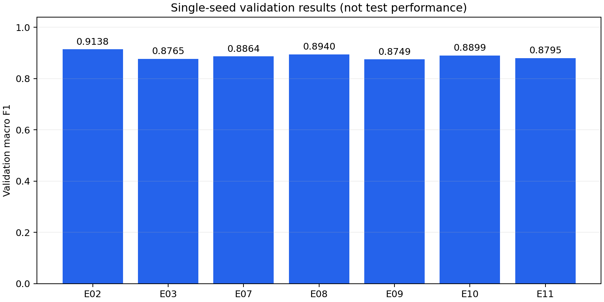

# Smartphone HAR

스마트폰 센서 구간으로 걷기·계단 오르기·계단 내려가기·앉기·서기·눕기를 분류하는 팀 프로젝트다. 현재 저장소에는 **이봉헌 담당 ② 기준모델 구현·공통 학습·조건 비교**와 실제 실행 결과를 정리했다.

**MLP 2종 · 후속 학습 24회 · 테스트 24개 통과 · 실행된 노트북 3개**

> 최신 보강은 기존 7조건×3seed와 초기값 일치 Dropout 대조 3회다. 검증 5명, 1,775개 구간을 고정했다. 공식 시험 평가와 전체 팀 모델의 비교는 후속 단계다. 아래 원래 결과 표는 v1의 seed 2026 기록이다.

## 최신 심화 검증

잘못된 분할 인덱스의 묵시적 변환과 원본 검증 입력의 정렬 누락을 재현하고 수정했다. 같은 seed에서도 Dropout 모델의 초기 Dense 가중치가 달라지는 것을 확인하여 초기값을 복사한 E08W 대조를 추가했다. 실제 결함과 의도적인 수학 오류 주입을 구분한다.

[**21쪽 심화 보고서·20장 PPT·MD·질의응답 34개**](docs/process-report/README.md) · [전체 실험 근거](reports/process_audit/) · [코드·학습 모델·문서 v2 릴리스](https://github.com/kara320090/smartphone-har/releases/tag/bongheon-process-v2)

E02의 3seed 검증 Macro F1은 **0.9046 ± 0.0123 (표본 SD)**이다. seed마다 최고 조건이 달라졌다. SD는 고정 사람 분할의 학습 변동이며 새 사람 모집단의 신뢰구간이 아니다.

## 먼저 볼 문서

| 목적 | 문서 |
|---|---|
| 팀 공동 논문 준비와 개인 원고 작성 | [역할별 작업·결과물·작성 양식·취합 절차](docs/team-paper/README.md) |
| 담당 업무와 완료 내역 확인 | [이봉헌 담당 업무 정리](docs/BONGHEON_WORK_SUMMARY.md) |
| 최신 심화 보고서와 PPT | [21쪽 Word·20장 PPT·질의응답·작업 과정](docs/process-report/README.md) |
| 최초 구현 설명과 보고서 | [v1 Word·PPT·MD 원문](docs/personal-report/README.md) |
| 처음 실행하기 | [시작 안내](START_HERE_KO.md) · [상세 설치와 실행](docs/RUN_GUIDE_KO.md) |
| 실제 점수와 학습 곡선 확인 | [실험 결과](reports/RESULTS_KO.md) · [가설과 해석](docs/EXPERIMENT_NOTES_KO.md) |
| 팀원 코드와 연결하기 | [입력 계약과 인계](docs/HANDOFF_KO.md) |
| 발표와 진행 준비 | [발표 원고](docs/PRESENTATION_KO.md) · [팀장 작업표](docs/TEAM_TASKS_KO.md) |
| 전체 문서 찾기 | [문서 목차](docs/README.md) |

## 빠른 시작

검증 환경은 **Windows CPU / Python 3.11.9 / TensorFlow 2.21.0 / Keras 3.15.1**이다. PowerShell에서 다음 순서로 실행한다.

```powershell
git clone https://github.com/kara320090/smartphone-har.git
cd smartphone-har
py -3.11 -m venv .venv
.\.venv\Scripts\python.exe -m pip install -r requirements.txt
.\.venv\Scripts\python.exe scripts/download_data.py
.\.venv\Scripts\python.exe -m src.train --config configs/E02.json --smoke --runs-dir runs/smoke
```

마지막 명령은 실제 학습 60개·검증 30개로 2 epoch를 실행하는 연결 검사다. 정식 7개 실험의 실행·검증 명령과 노트북 사용법은 [상세 안내](docs/RUN_GUIDE_KO.md)에 있다. 기존 실행 폴더는 덮어쓰지 않으므로 재실행 시 새 `--runs-dir`을 지정한다.

## 최초 단일 seed 실험 결과

| ID | 조건 | 검증 Accuracy | 검증 Macro F1 |
|---|---|---:|---:|
| E02 | 특징 MLP 기준 | 0.9161 | **0.9138** |
| E03 | 시계열 MLP | 0.8783 | 0.8765 |
| E07 | 표준화 제거 | 0.8873 | 0.8864 |
| E08 | Dropout 0.3 | 0.8952 | 0.8940 |
| E09 | 학습률 0.0003 | 0.8772 | 0.8749 |
| E10 | 학습률 0.003 | 0.8913 | 0.8899 |
| E11 | PCA 95% | 0.8811 | 0.8795 |

학습 16명 5,577개와 검증 5명을 분리했다. 표준화와 PCA는 학습 데이터로만 계산했다. 공통 설정은 batch 64, 최대 40 epoch, 검증 손실 기준 patience 6이며 최저 검증 손실의 가중치를 복원했다. [전체 결과와 해석](reports/RESULTS_KO.md)을 함께 확인한다.



## 학습 모델 다운로드

[**봉헌 담당 v1 릴리스 — 코드·모델·결과 ZIP**](https://github.com/kara320090/smartphone-har/releases/tag/bongheon-part2-v1)

ZIP에는 `runs/formal/`의 학습 모델 7개와 전처리·설정·예측 기록이 포함된다. Git 저장소에는 코드·문서·요약 근거를 보관하고, 원 데이터와 가상환경은 각 환경에서 준비한다. 저장 모델 사용 순서는 [시작 안내](START_HERE_KO.md#저장된-모델-사용)에 정리했다.

## 폴더 구성

```text
src/          MLP, 공통 학습, 참조 데이터 어댑터, 수학·재로딩 검증
configs/      E02·E03·E07–E11의 고정 실험 설정
scripts/      공식 데이터 다운로드, 노트북 생성, 로컬 실행
tests/        데이터 누수·모델·기울기·학습·저장 검증
notebooks/    실제 실행한 설명 노트북 3개
reports/      실험 결과, 그래프, 수치 검증 기록
docs/         담당 업무, 상세 실행, 팀 인계, 해석, 발표
```

## 검증과 다음 연결

최초 검증은 테스트 8개, 노트북 3개, TFRecord 200개 표본 왕복, 모델 7개 예측 재현이다. 후속 보강에서는 테스트 24개, 작은 ReLU 네트워크 수치미분 138회, 기존 7조건 재학습 예측 일치, 새 모델 24개 재로딩을 확인했다. [최초 기록](reports/VERIFICATION_KO.md)과 [후속 기록](reports/process_audit/summary.json)을 구분해 제공한다.

①의 데이터 모듈, ③의 비교 모델, ④의 반복·시험 평가, ⑤의 추론·시연은 [공통 계약](docs/HANDOFF_KO.md)에 맞춰 연결한다. 실제 팀원 환경에서의 실행 확인은 공동 작업표에 남겨두었다.

## 데이터 출처

[UCI Human Activity Recognition Using Smartphones](https://archive.ics.uci.edu/dataset/240/human+activity+recognition+using+smartphones), Reyes-Ortiz 외, DOI **10.24432/C54S4K**, **CC BY 4.0**. 학습·분할·실험 구성은 제공된 10주 프로젝트 상세계획서를 따른다. 라이브러리 문서와 재현 조건은 [상세 안내](docs/RUN_GUIDE_KO.md)에 정리했다.
