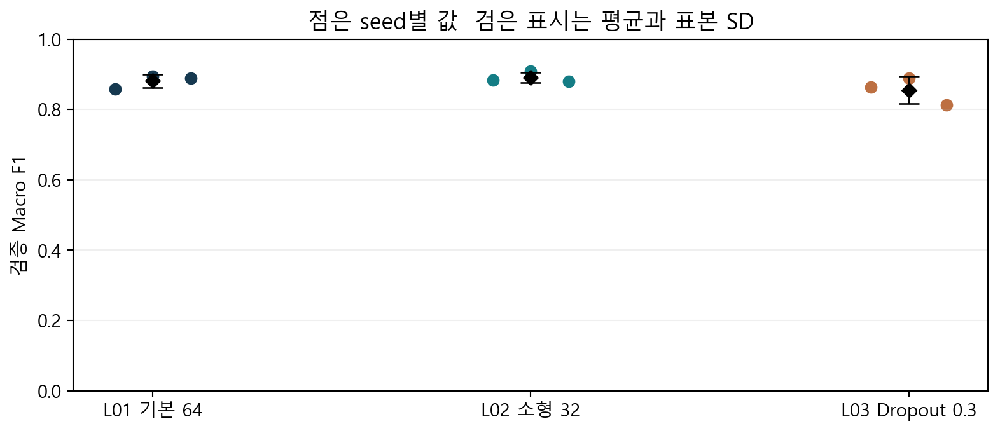
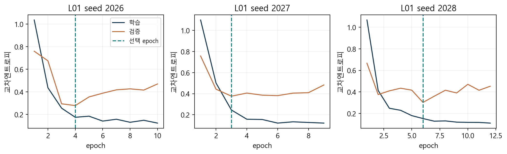
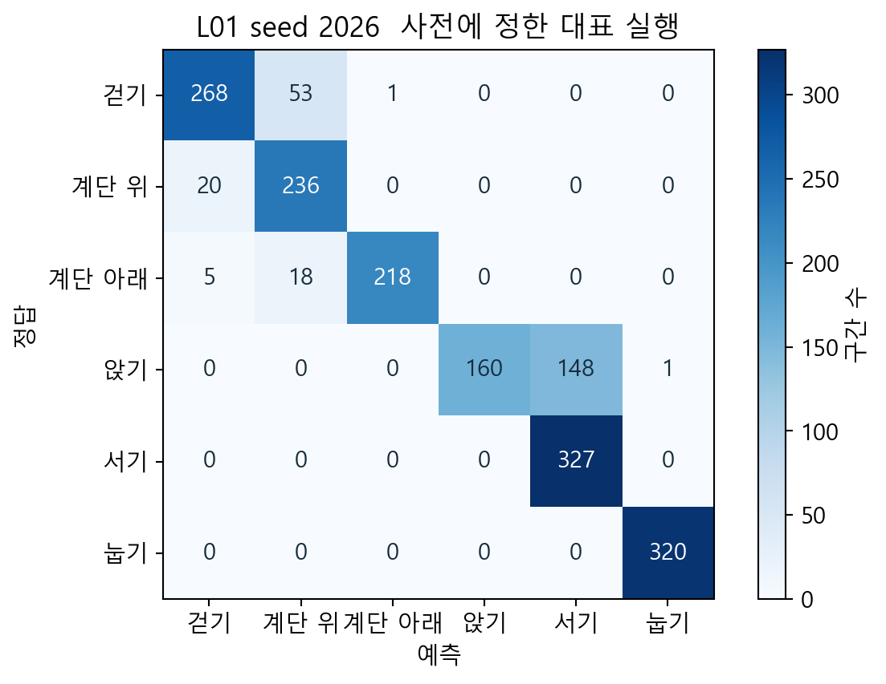
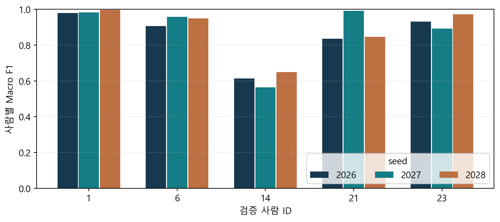

# 스마트폰 행동 인식 LSTM 구현과 검증 보고서

이봉헌  2026년 10월 9일  개인 담당 연구 기록

이 보고서는 UCI HAR의 센서 구간을 분류하는 LSTM을 구현하고, 사용자 단위로 분리된 검증 자료에서 기본 구조·소형 구조·Dropout 조건을 비교한 기록이다. 코드 연결, 미분 검산, 저장 모델 재검증과 실제 실험 결과를 함께 제시하여 팀 공동 논문에 사용할 근거를 정리한다.

공동 비교에 제공할 L01의 검증 Macro F1은 0.8813 ± 0.0195이며 Accuracy 평균은 88.32%다. ±는 동일 사람 분할에서 학습 seed 세 개의 표본 표준편차다. 공식 test의 성능은 측정하지 않았다.

| 범위 | 실제 수행 |
| --- | --- |
| 모델 | LSTM 64 기준, LSTM 32, 기준 구조의 외부 Dropout 0.3 |
| 실험 | 세 조건과 seed 2026·2027·2028의 9회 |
| 자료 | fit 5,577구간, validation 1,775구간 |
| 검증 | 39개 코드 테스트, 58개 파라미터의 174회 중앙차분 |
| 인계 | 코드, 저장 모델, 예측·지표, 원고·발표·재현 안내 |

결론의 범위는 고정된 다섯 검증 사람과 사전에 정한 세 설정이다. 다른 팀원의 모델이나 스마트폰 실장치 성능을 이 보고서에서 새로 측정한 것으로 취급하지 않는다.

# 담당 범위와 근거의 연결

현재 역할은 데이터 정회서, MLP 한윤섭, CNN 최승빈, RNN 유재윤, LSTM 이봉헌이다. 나는 완료된 데이터와 통계를 받아 LSTM 경로를 연결하고, 세 조건의 학습·평가·저장·재검증을 수행하였다. 공통 입력과 결과 규격도 정리하여 팀원이 같은 기준으로 비교할 수 있게 했다.

기존에 수행한 MLP 실험은 이전 기록으로 보존했다. 과거 MLP 점수를 LSTM 결과로 옮기거나 기존 작성자를 바꾸지 않았다. 최종 공동 논문에서 모델 간 우열을 말하려면 각 담당자의 실제 실행 결과와 조건을 추가로 대조해야 한다.

| 주장 | 확인 자료 |
| --- | --- |
| 같은 센서 구간을 사용 | dataset_audit.json과 데이터 파일 SHA256 |
| 같은 초기값의 Dropout 비교 | initial_weights.npz와 initialization.json |
| 지표를 다시 계산 가능 | validation_predictions.csv와 분석 CSV |
| 저장 모델을 다시 사용 가능 | fresh_process_verification.json |
| 작은 LSTM 미분의 일치 | gradient_checks.csv와 math_verification.json |

기여는 실제 수행한 코드·분석·문장과 팀원에게 받은 자료로 구분한다. 구현 및 문서 제작에는 Codex 보조를 사용했다. 실행 로그와 자동 검증 결과는 남겼으며, 발표자 본인의 코드 이해와 최종 원고 검토는 별도로 필요하다. 도구가 작성한 설명만으로 개인의 숙련도를 증명하지 않는다.

정식 학습은 코드 커밋 95422e099393에서 시작했다. 각 실행 metadata의 코드 해시와 설정을 함께 보관하여 문서 작성 이후에도 학습 당시 근거를 식별할 수 있게 했다.

# 데이터 출처와 사용자 독립 분할

UCI HAR는 허리에 스마트폰을 착용한 참여자의 가속도·자이로 신호를 이용하는 공개 자료다. 공식 데이터 설명에 따르면 50 Hz 신호를 128시점 구간으로 구성했고 인접 구간에는 중첩이 있다. 따라서 이번 입력을 완전한 원시 측정 신호로 부르지 않는다. [1, 2]

팀 캐시는 시계열 Xs, 특징 Xf, 정답 y, 사람 subject, sample_id를 가진다. LSTM은 Xs만 사용하며 561개 가공 특징이나 PCA 입력은 사용하지 않았다. 사람 ID와 표본 ID는 분할·평가·추적용이고 분류 입력에 포함하지 않았다.

| 라벨 | 활동 | 학습 구간 | 검증 구간 |
| --- | --- | --- | --- |
| 0 | 걷기 | 904 | 322 |
| 1 | 계단 오르기 | 817 | 256 |
| 2 | 계단 내려가기 | 745 | 241 |
| 3 | 앉기 | 977 | 309 |
| 4 | 서기 | 1047 | 327 |
| 5 | 눕기 | 1087 | 320 |

학습 사람은 3·5·7·8·11·15·16·17·19·22·25·26·27·28·29·30, 검증 사람은 1·6·14·21·23이다. 공식 train의 21명을 두 집합으로 나누었고 사람 및 표본 ID의 교집합은 없다. 동일 참여자의 중첩 구간을 무작위로 양쪽에 흩어 놓는 평가를 피했다.

검증은 1,775개 구간을 이용하지만 독립된 사람은 다섯 명이다. 구간 수를 독립 참여자 수처럼 계산하거나 이를 근거로 모집단의 좁은 신뢰구간을 제시하지 않았다.

# 전처리 완료 파일을 확인한 과정

processed_data라는 파일명만으로 모든 변환의 적용 여부를 판단할 수 없었다. 생성 코드를 읽고 배열의 채널별 평균·표준편차를 측정하니, 캐시는 분할된 구간을 저장하고 표준화 통계는 별도 파일에 저장하는 구조였다. 이 확인은 데이터 담당자의 완료 작업을 다시 만드는 과정이 아니라 모델 입력 상태를 명확히 하는 과정이다.

저장된 seq_mean과 seq_std는 전체 fit 배열에서 동일한 float32 연산으로 계산한 값과 원소별로 일치했다. 새 학습 경로는 이 통계를 불러와 한 번만 적용한다. validation으로 평균이나 표준편차를 갱신하지 않는다. 소량 연결 검사에서도 전체 fit에서 이미 만든 통계를 유지했다.

`x′ = (x − μfit) / σfit`

| 검사 | 관찰 |
| --- | --- |
| 학습 배열 통계와 저장 통계 | 평균과 표준편차 모두 원소별 동일 |
| 중복 표준화의 수치 영향 | 한 번 적용한 입력 대비 최대 차이 109.333313 |
| 기존 float64 경로와 팀 float32 경로 | 검증 입력 최대 차이 0.00685120 |
| 이번 선택 | 팀 float32 통계를 유지하고 한 번만 적용 |

위 차이는 입력 배열의 수치 비교이며 분류 성능 손실을 측정한 결과가 아니다. 특정 전처리가 더 정확하다고 결론 내리지 않는다. 통계 정밀도와 변환 횟수를 기록한 이유는 서로 다른 입력을 같은 조건이라고 취급하는 실수를 방지하기 위해서다.

# 원본 행과 저장 규격을 연결한 검증

기존 참조 학습 코드의 표본 행 번호는 1부터 시작하지만 팀 캐시의 번호는 0부터 시작한다. 단순 문자열 치환으로 맞추지 않고 sample_id에서 원 행 번호를 읽어 공식 train의 정답·사람 ID·시계열 값과 대응시켰다.

fit과 validation을 합친 7,352개 구간의 모든 9채널 값을 원본 train 텍스트와 대조한 결과 값이 정확히 일치했다. 정답과 사람 ID도 같은 원본 행과 일치했다. 공식 test 배열은 이 검사에서 접근하지 않았다. 이 검사는 단순히 shape와 값 범위를 맞추는 것보다 강한 행 정합성 근거다.

| 연결 차이 | 처리와 검증 |
| --- | --- |
| 0 기반 ID와 기존 1 기반 ID | 캐시 ID 보존, metadata의 행 번호 기준 분리 |
| 전처리 저장 형식 | team_sequence_npz_v1을 분리하고 기존 형식 유지 |
| 입력과 ID의 사후 순서 변경 | 행·정답·ID·사람을 결합한 해시 검사 |
| test가 포함된 NPZ | fit·val 키만 명시적으로 접근 |
| 파일 변경 | 고정 데이터·통계 SHA256이 다르면 거부 |

이 항목들은 실제 소스와 배열에서 확인한 연결 차이다. 기존 학습에서 데이터 누출이나 성능 사고가 발생했다는 주장으로 바꾸지 않는다. 원본과 함께 잘못 전달된 정보는 해시만으로 의미를 판정할 수 없으므로 원본 행 대조를 추가하였다.

# LSTM의 게이트와 셀 상태

LSTM은 순환 구조 안에서 은닉 상태와 셀 상태를 갱신한다. 본 구현은 현대 Keras의 입력·망각·출력 게이트를 갖는 형태다. 1997년 LSTM의 기본 아이디어와 이후 망각 게이트 확장을 구분하여 참고하였다. [3, 4, 5]

`iₜ = σ(xₜWᵢ + hₜ₋₁Uᵢ + bᵢ)`

`fₜ = σ(xₜWf + hₜ₋₁Uf + bf)`

`gₜ = tanh(xₜWg + hₜ₋₁Ug + bg)`

`oₜ = σ(xₜWo + hₜ₋₁Uo + bo)`

`cₜ = fₜ ⊙ cₜ₋₁ + iₜ ⊙ gₜ`

`hₜ = oₜ ⊙ tanh(cₜ)`

입력 게이트는 새 후보 정보의 반영 정도, 망각 게이트는 이전 셀 정보의 유지 정도, 출력 게이트는 은닉 상태로 드러낼 정도를 조절한다. ⊙는 원소별 곱이다. 이번 네트워크는 각 128시점 구간의 마지막 은닉 상태를 Dense 분류기에 전달한다.

셀 상태가 존재한다는 사실이 모든 문제에서 기울기 소실을 없애거나 긴 의존 관계를 학습했다는 증거는 아니다. 이번 실험은 128시점의 분류 성능을 측정하며 게이트의 인과적 역할이나 장기 기억 능력을 독립적으로 평가하지 않았다.

# 시간축 역전파의 계산과 검산

시간축 역전파는 미래 시점에서 전달된 은닉 상태와 셀 상태의 기울기를 더한 뒤 각 게이트의 연쇄법칙을 적용한다. 같은 kernel과 recurrent kernel을 모든 시점에서 공유하므로 파라미터 기울기는 시점별 기여를 합산해야 한다.

`dcₜ += dhₜ ⊙ oₜ ⊙ (1 − tanh²(cₜ))`

`dfₜ = dcₜ ⊙ cₜ₋₁`

`dzfₜ = dfₜ ⊙ fₜ ⊙ (1 − fₜ)`

`dcₜ₋₁ = dcₜ ⊙ fₜ`

출력 손실은 두 표본의 평균 교차엔트로피로 정의했고, logits에 대한 오차를 배치 크기로 나누었다. 각 시점의 게이트 미분을 i·f·g·o 순서로 묶어 입력 kernel과 recurrent kernel의 기울기를 계산했다. NumPy 코드와 TensorFlow 코드의 게이트 순서도 맞췄다.

| 검산 방법 | 독립적으로 확인하는 항목 |
| --- | --- |
| NumPy 순전파·BPTT | 직접 작성한 상태 갱신과 연쇄법칙 |
| TensorFlow 자동미분 | 동일한 가중치와 입력에서의 기준 기울기 |
| 중앙차분 | 손실 변화로 근사한 기울기 |
| 의도적 미분 누락 | 검산 절차가 틀린 기울기를 탐지하는지 |

이 수동 구현은 작은 교육용 예제다. 실제 HAR의 9회 학습은 Keras 자동미분과 Adam을 사용했으며 전체 모델을 NumPy로 직접 학습했다고 표현하지 않는다.

# 구현한 구조와 파라미터 수

| 층 | 출력 shape | L01 파라미터 | L02 파라미터 |
| --- | --- | --- | --- |
| 입력 | B × 128 × 9 | 0 | 0 |
| LSTM | B × 64 또는 B × 32 | 18,944 | 5,376 |
| Dense ReLU | B × 32 | 2,080 | 1,056 |
| 외부 Dropout | B × 32 | 0 | 0 |
| Dense logits | B × 6 | 198 | 198 |
| 합계 | 6클래스 분류 | 21,222 | 6,630 |

`LSTM 파라미터 수 = 4H(D + H + 1)`

입력 차원 D=9, 은닉 크기 H=64이면 LSTM 층은 18,944개 파라미터를 갖는다. 기본 모델의 총합은 21,222개, 소형 모델은 6,630개다. 은닉 크기 변경은 LSTM 층뿐 아니라 뒤 Dense 층의 입력 크기도 바꾸므로 전체 모델 규모의 변화로 해석한다.

stateful=False로 구간 사이 상태를 이어 쓰지 않는다. 시간축은 128이고 채널축은 9이다. return_sequences=False이므로 마지막 은닉 상태만 분류기에 전달한다. LSTM 내부 dropout과 recurrent_dropout은 0이며, L03에서 바꾸는 값은 Dense 뒤의 외부 Dropout이다.

unit_forget_bias=True와 Keras의 kernel·recurrent kernel 초기화 방식을 사용한다. seed는 모델 생성 전에 설정한다. 출력에는 softmax 활성화를 넣지 않고 여섯 logits를 반환하여 logits 기반 교차엔트로피와 함께 사용한다.

# 비교 질문과 초기 가중치 통제

| 조건 | 변경 요소 | 같게 유지한 요소 |
| --- | --- | --- |
| L01 | 기준 은닉 크기 64 | 공통 입력·학습·평가 |
| L02 | 은닉 크기 32 | 외부 Dropout 0, 학습 설정 |
| L03 | 외부 Dropout 0.3 | 은닉 크기 64와 L01 학습 전 가중치 |

모델마다 같은 seed를 지정하는 것만으로 모든 초기화 통제가 보장된다고 가정하지 않았다. L01의 학습 시작 전 가중치 배열을 별도로 저장하고, 같은 seed의 L03에 이를 복사한 뒤 모든 배열이 일치하는지 검사했다. L01의 학습된 최종 가중치를 L03의 시작점으로 사용하지 않았다.

L02는 행렬 크기가 달라 L01과 같은 가중치를 가질 수 없다. 따라서 L02 비교는 은닉 크기와 이에 따른 모델 규모 변경의 결과다. L03 비교도 Dropout으로 학습 중 확률적 경로가 바뀌는 조건이며 모든 중간 활성값이나 optimizer 궤적이 같아야 한다는 뜻은 아니다.

세 조건을 세 seed로 각각 실행했다. 조건과 선택 규칙을 결과 전에 파일과 Git 커밋으로 남겼다. 공동 논문에 전달할 기준은 L01로 고정하고, 보조 조건의 평균이 더 높더라도 자동으로 대표 모델을 교체하지 않는다. 다른 팀원에게도 동일한 후보 탐색 예산을 적용하지 않은 상태에서 튜닝된 최선값을 공정 비교라고 부를 수 없기 때문이다.

이번 비교의 질문은 정해진 조건 안에서 관찰한 성능과 변동이다. 모든 구조·학습률·규제 조합을 탐색한 최적 LSTM이라는 주장은 하지 않는다.

# 공통 학습과 체크포인트 선택

| 항목 | 실제 설정 |
| --- | --- |
| seed | 2026, 2027, 2028 |
| optimizer | Adam β1=0.9, β2=0.999, ε=1e-7 |
| 학습률과 batch | 0.001, 64 |
| 최대 epoch | 40 |
| 조기 종료 | val_loss, patience 6, min_delta 0 |
| 최종 가중치 | 최저 val_loss epoch 복원 |
| 실행 | CPU, intra-op 4, inter-op 1, 별도 프로세스 |
| 손실 | SparseCategoricalCrossentropy(from_logits=True) |

학습 자료는 epoch마다 셔플하고 검증 자료의 순서는 고정한다. 초기 probe 배치에서 손실과 모든 학습 가능 변수의 기울기가 유한한지 확인한다. 학습 중 loss·val_loss가 비유한 값이면 완료로 표시하지 않는다.

각 epoch에서 검증 Macro F1을 기록하지만 체크포인트 선택은 사전에 정한 val_loss를 따른다. F1이 가장 높은 epoch를 뒤늦게 골라 결과를 바꾸지 않는다. loss는 정답 확률을, F1은 argmax 분류와 클래스별 정밀도·재현율의 조합을 보기 때문에 선택 시점이 다를 수 있다.

저장 모델은 복원된 최선 가중치를 갖는다. optimizer 상태는 마지막 학습 시점일 수 있으므로 정확한 중단 지점 학습 재개용 파일이라고 부르지 않는다. 재로딩은 compile=False로 수행해 평가·추론용으로 검증하였다.

# 정상 입력과 실패 입력의 검증

기존 MLP 회귀 테스트와 새 LSTM 테스트를 함께 실행하여 총 39개가 통과했다. 연결 점검에서는 각 조건을 작은 자료로 2 epoch 학습하고 별도 프로세스에서 저장 모델을 다시 읽었다. 이 실행은 정식 9회 결과에 포함하지 않았다.

| 검사 입력 | 기대 동작과 확인 |
| --- | --- |
| 축을 바꾼 배열 | (N,9,128)을 입력 오류로 거부 |
| NaN 또는 잘못된 라벨 | 학습 전에 거부 |
| 중복 ID 또는 사람 중복 | 계약 검사에서 거부 |
| 다른 전처리 통계·파일 해시 | 출처 불일치로 거부 |
| 로딩 뒤 ID·정답·배열 순서 변경 | 행 결합 해시 또는 재변환 대조로 거부 |
| object dtype test sentinel | fit·val 로딩 성공, test 배열 미접근 |
| L03 초기값 원본 누락 | 학습 전에 거부 |

test sentinel은 읽으면 allow_pickle=False에서 실패하는 합성 배열이다. 이 배열을 포함한 NPZ에서도 개발 로더가 동작하는지 검사하여 test 배열을 실수로 전부 로딩하는 경로를 탐지한다. 공식 데이터의 test 성능을 측정하는 실험과는 무관하다.

테스트 통과는 모든 환경과 모든 입력에서 오류가 없다는 증명이 아니다. 검사한 실패 유형과 현재 라이브러리·환경의 동작을 보장하는 근거이며, 공식 원본과의 대조 및 전체 재예측을 함께 사용했다.

# 수학 검증의 실제 수치

| 항목 | 결과 |
| --- | --- |
| 작은 예제 | batch 2, 길이 3, 입력 2, 은닉 2, 출력 6 |
| 파라미터 | 58개 |
| 중앙차분 간격 | 1e-4, 1e-5, 1e-6 |
| 총 중앙차분 비교 | 174개 |
| 자동미분 최대 절대 차이 | 2.776e-17 |
| 수치미분 최대 절대 차이 | 2.481e-10 |
| 의도적 미분 오류 최대 차이 | 0.01394717 |

검산은 float64를 사용했다. 순전파 logits와 평균 손실을 먼저 일치시킨 뒤 모든 파라미터의 수동 기울기를 자동미분과 비교했다. 중앙차분은 각 파라미터를 양·음 방향으로 조금 움직였을 때 손실이 얼마나 바뀌는지 측정한다. 간격 세 개를 사용하여 하나의 수치 간격에만 의존하지 않았다.

음성 대조에서는 망각 게이트의 sigmoid 미분 f(1−f)를 의도적으로 생략했다. 검산기는 이 오차를 탐지했다. 이 실험은 Keras LSTM에서 실제 버그를 발견했다는 뜻이 아니라, 작성한 검산 절차가 잘못된 계산을 식별하는지 확인하는 검사다.

작은 예제는 포화가 심하지 않은 고정 입력과 가중치다. 128시점·64은닉·모든 데이터의 기울기를 수치미분한 것은 아니다. 대형 학습의 안정성은 유한성 검사와 실제 학습 로그로 별도 관찰했다.

# 정식 9회 실행 결과

| 조건 | seed | Accuracy | Macro F1 | 최선/실행 |
| --- | --- | --- | --- | --- |
| L01 | 2026 | 0.8614 | 0.8590 | 4/10 |
| L01 | 2027 | 0.8986 | 0.8952 | 3/9 |
| L01 | 2028 | 0.8896 | 0.8896 | 6/12 |
| L02 | 2026 | 0.8845 | 0.8844 | 8/14 |
| L02 | 2027 | 0.9070 | 0.9083 | 10/16 |
| L02 | 2028 | 0.8817 | 0.8807 | 4/10 |
| L03 | 2026 | 0.8665 | 0.8643 | 6/12 |
| L03 | 2027 | 0.8879 | 0.8883 | 6/12 |
| L03 | 2028 | 0.8152 | 0.8125 | 7/13 |

위 표는 검증 사람 다섯 명의 1,775개 구간에 대한 결과다. 학습 정확도나 공식 test 정확도가 아니다. 모든 실행의 저장 예측에서 Accuracy와 Macro F1을 다시 계산하여 metrics.json과 1e-12 이내로 일치함을 확인했다.

각 실행은 최대 40 epoch 안에서 조기 종료 규칙을 적용했다. 실행 epoch 수가 달라도 최선 가중치 선택 규칙은 같다. 학습 시간에는 graph tracing, 데이터 cache 준비, 검증, F1 callback이 포함된다. 데이터 로딩·저장·최종 재검증 시간은 별도이며, 작업 중 다른 문서 생성이 병행되었으므로 학습 시간의 작은 차이를 모델 효율의 정밀한 순위로 해석하지 않는다.

학습·검증 loss와 F1의 전체 기록은 각 실행 history.csv에 있다. 표에 남긴 값만으로 모델을 다시 선택하지 않고 전체 실행을 보존한다. 최고 seed 하나만 대표로 제시하면 변동을 감추므로 세 seed를 모두 공개한다.

# 조건별 평균과 seed 변동

| 조건 | Macro F1 평균 ± SD | Accuracy 평균 | 파라미터 |
| --- | --- | --- | --- |
| L01 | 0.8813 ± 0.0195 | 0.8832 | 21,222 |
| L02 | 0.8911 ± 0.0150 | 0.8911 | 6,630 |
| L03 | 0.8550 ± 0.0387 | 0.8565 | 21,222 |

L02의 L01 대비 Macro F1 평균 차이는 +0.98 percentage points다. 같은 seed별 차이는 +2.54, +1.30, -0.89 percentage points였다. 이 수치는 해당 고정 분할의 관찰이며 보편적인 우월성이나 유의성 판정으로 확대하지 않는다.

L03의 L01 대비 Macro F1 평균 차이는 -2.62 percentage points다. 같은 seed별 차이는 +0.53, -0.69, -7.71 percentage points였다. 이 수치는 해당 고정 분할의 관찰이며 보편적인 우월성이나 유의성 판정으로 확대하지 않는다.

# 학습 곡선과 선택 epoch의 해석

학습 손실이 계속 내려가도 검증 손실은 상승하거나 진동할 수 있다. 새로운 사람에게 잘 맞는지 확인하는 목적에서는 학습 자료 적합도와 검증 일반화를 나누어 보아야 한다. 이번 선택 규칙은 검증 손실의 최솟값을 사용하고 이후 patience만큼 개선이 없으면 종료한다.

L01 seed 2026는 10 epoch를 실행하고 4 epoch 가중치를 복원했다. 이 체크포인트의 Macro F1은 0.8590다. epoch 선택과 최종 성능 값을 같은 실행 ID로 연결하였다.

L01 seed 2027는 9 epoch를 실행하고 3 epoch 가중치를 복원했다. 이 체크포인트의 Macro F1은 0.8952다. epoch 선택과 최종 성능 값을 같은 실행 ID로 연결하였다.

L01 seed 2028는 12 epoch를 실행하고 6 epoch 가중치를 복원했다. 이 체크포인트의 Macro F1은 0.8896다. epoch 선택과 최종 성능 값을 같은 실행 ID로 연결하였다.

곡선만으로 기울기 소실·폭주를 진단하지 않았다. 유한성 검사 통과는 NaN·Inf를 배제하는 근거이며, 시간축에서 유효한 정보가 충분히 유지되는지 증명하는 근거는 아니다. 별도의 기울기 통계나 시간 순서 대조가 없으므로 인과 설명은 제한한다.

# 클래스별 혼동과 오류 사례

이 실행에서 큰 비대각 혼동은 앉기를 서기로 분류한 148개, 걷기를 계단 위로 분류한 53개, 계단 위를 걷기로 분류한 20개였다. 혼동행렬의 구간 수와 클래스별 precision·recall·F1을 함께 확인하여 전체 평균이 감추는 차이를 살폈다.

특정 정적 자세가 혼동되었다고 해서 센서 위치나 참여자 습관이 원인이라고 확정할 수는 없다. 이런 설명은 가능한 가설이며 원인 검증을 하려면 원 신호·추가 조건·새 실험이 필요하다. 모든 오분류의 sample_id와 예측 확률을 errors.csv에 남겨 후속 확인이 가능하게 했다.

# 실제 오류 표본과 관찰 가능한 신호

| sample_id | 사람 | 정답→예측 | 확률 | body_acc_x SD |
| --- | --- | --- | --- | --- |
| train:002469 | 14 | 0→1 | 0.9804 | 0.2168 |
| train:002468 | 14 | 0→1 | 0.9802 | 0.2106 |
| train:002485 | 14 | 0→1 | 0.9783 | 0.2164 |
| train:002484 | 14 | 0→1 | 0.9773 | 0.2064 |
| train:002486 | 14 | 0→1 | 0.9736 | 0.2202 |

L01 seed 2026의 오분류 중 예측 확률 상위 10개를 원자료에 남기고 위 표에는 상위 5개를 표시했다. 이 목록은 전체 오류 246개의 무작위 표본이 아니다. 10개 모두 사람 14의 걷기(0)를 계단 오르기(1)로 분류한 입력이다. 인접한 원 행도 있어 독립된 사례로 가정하지 않는다.

표의 SD는 128시점 body_acc_x 값의 모집단 표준편차이며, 모델 입력 표준화 전의 UCI 처리 구간에서 계산했다. 모든 오류의 9채널 평균·표준편차·RMS를 error_signal_features.csv에 보관하였다. 이 수치만으로 오분류의 원인이나 신체 행동의 차이를 확정하지 않는다.

| 활동 | Precision | Recall | F1 | 구간 수 |
| --- | --- | --- | --- | --- |
| 걷기 | 0.9147 | 0.8323 | 0.8715 | 322 |
| 계단 위 | 0.7687 | 0.9219 | 0.8384 | 256 |
| 계단 아래 | 0.9954 | 0.9046 | 0.9478 | 241 |
| 앉기 | 1.0000 | 0.5178 | 0.6823 | 309 |
| 서기 | 0.6884 | 1.0000 | 0.8155 | 327 |
| 눕기 | 0.9969 | 1.0000 | 0.9984 | 320 |

앉기 recall은 낮고 서기 precision도 낮다. 혼동행렬의 앉기→서기 148개와 함께 읽으면 해당 실행의 약점을 구체적으로 설명할 수 있다. 높은 예측 확률이 정답을 보장하지 않는다는 사실은 위 오류 사례에서 확인되지만, 확률 보정 성능은 이번에 평가하지 않았다.

# 사람별 결과와 집계 단위

| 사람 | 구간 수 | L01 F1 평균 | seed SD |
| --- | --- | --- | --- |
| 1 | 347 | 0.9860 | 0.0100 |
| 6 | 325 | 0.9370 | 0.0274 |
| 14 | 323 | 0.6089 | 0.0420 |
| 21 | 408 | 0.8910 | 0.0869 |
| 23 | 372 | 0.9318 | 0.0398 |

전체 구간을 합친 Macro F1과 사람별 Macro F1의 단순 평균은 같은 지표가 아니다. 클래스별 표본 수와 혼동 구조가 다르기 때문이다. 대표 성능표는 전체 1,775구간의 Macro F1을 사용하고 사람별 결과는 성능이 특정 사람에게 편중되는지를 보는 보조 분석으로 구분한다.

다섯 사람이 전체 사용자 집단을 대표한다고 가정하지 않는다. 추가 사람 분할이나 새로운 참여자 데이터는 이번 범위 밖이므로 사용자 독립 분할에서의 결과와 다양한 사용자에게 안정적이라는 주장을 구분한다.

# 저장 모델 복원과 추론 시간

| 조건 seed | median ms | p95 ms |
| --- | --- | --- |
| L01_seed2026 | 4.706 | 7.211 |
| L01_seed2027 | 4.669 | 6.667 |
| L01_seed2028 | 4.731 | 8.352 |
| L02_seed2026 | 4.387 | 7.159 |
| L02_seed2027 | 6.162 | 8.668 |
| L02_seed2028 | 4.359 | 7.967 |
| L03_seed2026 | 4.783 | 7.251 |
| L03_seed2027 | 4.672 | 7.471 |
| L03_seed2028 | 4.626 | 7.713 |

모든 시간은 같은 CPU 환경에서 batch 1로 측정했다. tf.function으로 컴파일한 모델에 준비된 Tensor를 전달하고 .numpy()로 출력 반환이 끝날 때까지 잰다. 워밍업 50회 후 500회의 원자료에서 median과 p95를 계산했다. 최초 tracing·파일 로딩·입력 Tensor 생성은 이 범위에 포함하지 않는다.

전처리의 입력 검사와 표준화 시간은 별도의 500회로 기록했다. 모델 시간과 전처리 시간을 따로 측정했으므로 두 median의 합을 직접 측정한 전체 시스템 latency로 표현하지 않는다. PC CPU의 결과를 스마트폰 실장치의 처리 성능으로 주장하지 않는다.

9개 모델 모두 저장 후 새 프로세스에서 전체 검증 1,775개를 재예측했다. 확률의 rtol=1e-5·atol=1e-6 및 클래스 일치를 확인했다. 이는 저장 모델을 현재 환경에서 다시 사용할 수 있다는 근거이며 정확한 optimizer 재개나 다른 장치에서의 비트 단위 동일성을 보장하지 않는다.

# 문제 확인과 해결 과정의 정리

| 종류 | 확인한 내용 | 대응과 남은 범위 |
| --- | --- | --- |
| 실제 연결 차이 | 표준화 적용 상태와 파일 형식 | 소스·통계 대조 후 전용 로더 사용 |
| 실제 연결 차이 | sample_id 0 기반과 1 기반 | 원본 7,352행 대조와 metadata 분리 |
| 통제 설계 | 같은 초기값의 Dropout 비교 | L01 학습 전 배열 복사와 일치 검사 |
| 의도적 대조 | 망각 게이트 미분 생략 | 최대 차이 측정과 검산 실패 확인 |
| 방어 검사 | 잘못된 입력·정렬·통계 | 회귀 테스트로 거부 동작 확인 |

개발 과정을 설명할 때 실제로 일어난 연결 문제와 검증기를 시험하기 위해 만든 입력을 분리했다. 데이터 파일명이 곧 표준화 완료를 뜻한다고 가정했으면 중복 또는 누락 적용이 생길 수 있었으나, 이번 정식 실행은 검사 후 한 번 적용하는 경로로 고정하였다. 겪지 않은 학습 사고를 회고처럼 쓰지 않았다.

성능의 한계도 해결하지 않은 채 남겨야 할 연구 결과다. 단일 사람 분할, seed 세 개, 고정 설정 세 조건, validation 기반 선택, 새 사용자·새 기기 미검증이라는 범위를 명시한다. 낮은 점수를 삭제하거나 새 모델과 입력을 섞어 높은 숫자만 제시하지 않는다.

HAR 선행연구에는 합성곱과 LSTM을 결합한 구조도 있다. 이번 단일 LSTM은 해당 구조를 재현하거나 동일한 데이터·평가에서 능가했다고 주장하지 않는다. 관련 연구는 연구 질문의 배경으로 인용하고 다른 벤치마크의 수치를 직접 순위표에 넣지 않았다. [6]

# 팀 논문에 제공할 LSTM 원고

본 연구의 LSTM은 동일한 스마트폰 센서 구간을 순차적으로 처리하는 비교 모델이다. 전처리가 준비된 UCI HAR 자료에서 128시점과 9채널의 입력을 사용하고, 학습 사람 16명과 검증 사람 5명을 분리하였다. 저장된 학습 통계로 표준화를 한 번 적용했으며 공식 test는 개발에 사용하지 않았다.

모델은 64개 은닉 유닛의 LSTM, 32차원 ReLU Dense, 여섯 logits의 출력층으로 구성하였다. 구간마다 상태를 독립적으로 초기화하고 마지막 은닉 상태로 활동을 분류하였다. 총 파라미터 수는 21,222개다. 손실은 logits 기반 sparse categorical cross-entropy로 정의하였다.

Adam 학습률 0.001, batch 64, 최대 40 epoch, 검증 손실 기준 patience 6을 공통 적용하였다. seed 2026·2027·2028에서 반복하고 검증 손실이 최소인 가중치를 복원하였다. 모델과 전처리·표본 ID·설정·환경을 같은 실행 단위로 저장하였다.

기준 LSTM의 검증 Macro F1은 0.8813 ± 0.0195, Accuracy 평균은 88.32%였다. 표준편차는 고정 분할에서 세 학습 seed의 변동이다. 각 실행의 예측에서 지표를 재계산하고, 새 프로세스에서 1,775개 검증 구간의 저장 모델 예측을 대조하였다.

추가 분석에서는 은닉 크기 32의 모델과 외부 Dropout 0.3 조건을 비교하였다. 두 조건의 Macro F1 평균은 각각 0.8911과 0.8550였다. Dropout 조건은 같은 seed의 기본 모델 학습 전 가중치를 복사하였다. 보조 조건은 공동 모델 비교용 기준 결과와 분리하였다.

작은 LSTM의 NumPy 순전파와 시간축 역전파를 자동미분 및 중앙차분과 비교하여 계산을 검산하였다. 이 교육용 검사와 실제 Keras 기반 학습을 구분하였다. 단일 검증 사람 분할과 적은 seed 수의 한계가 있으며, 다른 팀원 모델의 공정 비교와 공식 test 평가는 공동 후속 절차에 따른다.

# 재현 절차와 참고문헌

저장소를 내려받아 requirements.txt의 환경을 준비한다. 팀의 processed_data.npz와 제공 통계의 SHA256을 대조한 뒤 소량 점검, 정식 suite, 분석 명령 순서로 실행한다. CLI의 --help와 RUN_GUIDE_LSTM_KO.md에 Windows 예시를 제공한다. 정식 출력 폴더가 있으면 덮어쓰지 않으며 실패 실행도 보존한다.

공동 비교에는 L01 세 seed의 config·예측·지표·모델과 동일 데이터 버전을 전달한다. 파일 이름만 같다고 같은 입력이라고 가정하지 않는다. 팀원 결과가 모인 후 데이터·분할·탐색 예산·epoch 선택 규칙을 대조하고, 동일 장치의 시간 측정만 함께 비교한다.

[1] UCI Machine Learning Repository. Human Activity Recognition Using Smartphones. DOI 10.24432/C54S4K. https://archive.ics.uci.edu/dataset/240/human+activity+recognition+using+smartphones

[2] Anguita D. et al. A Public Domain Dataset for Human Activity Recognition Using Smartphones. ESANN, 2013. https://www.esann.org/sites/default/files/proceedings/legacy/es2013-84.pdf

[3] Hochreiter S., Schmidhuber J. Long Short-Term Memory. Neural Computation 9(8), 1735–1780, 1997. https://www.bioinf.jku.at/publications/older/2604.pdf

[4] Gers F. A., Schmidhuber J., Cummins F. Learning to Forget: Continual Prediction with LSTM. Neural Computation 12(10), 2451–2471, 2000. https://sferics.idsia.ch/pub/juergen/FgGates-NC.pdf

[5] Keras 3. LSTM layer. https://keras.io/api/layers/recurrent_layers/lstm/ (확인 2026-10-09).

[6] Ordóñez F. J., Roggen D. Deep Convolutional and LSTM Recurrent Neural Networks for Multimodal Wearable Activity Recognition. Sensors 16(1), 115, 2016. DOI 10.3390/s16010115. https://pmc.ncbi.nlm.nih.gov/articles/PMC4732148/
