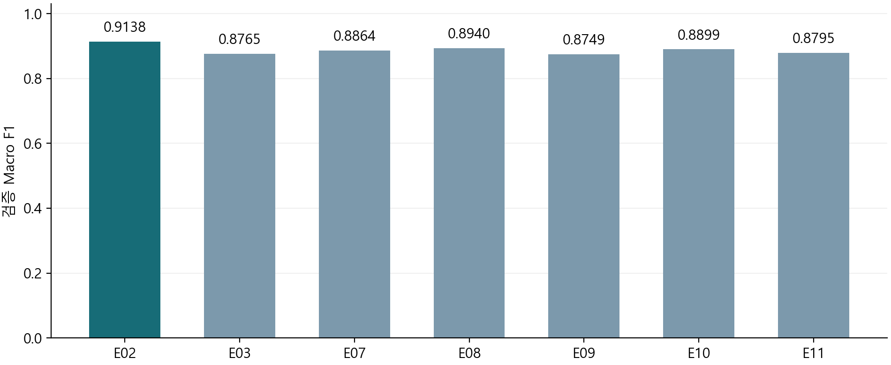
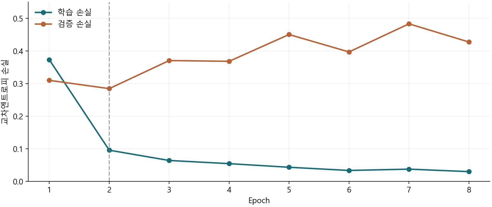

# 스마트폰 행동 인식 기준모델 구현과 학습 실험 보고서

개인 담당: 이봉헌  |  ② 기준모델 구현·학습 및 팀장

실험 기준일: 2026년 9월 28일  |  문서 작성일: 2026년 9월 29일

## 연구 목적과 핵심 결과

UCI 스마트폰 행동 인식 자료를 이용해 6가지 행동을 분류하는 MLP 기준모델을 구현하고, 공통 학습 코드와 재현 가능한 저장 형식을 마련하였다. 입력 표현, 표준화, Dropout, 학습률, PCA 조건을 바꾼 7개 실험을 수행하였다.

특징 MLP인 E02가 이번 7개 실험 중 가장 높은 검증 Accuracy 0.9161과 Macro F1 0.9138을 기록하였다. 결과는 고정된 사람 분할과 seed 2026에서 얻은 검증 성능이다. 공식 시험 자료의 성능이나 전체 팀 모델의 최종 성능은 아직 측정하지 않았다.

| 구분 | 실제 산출물 |
| --- | --- |
| 모델 | 561차원 특징 MLP 및 128×9 시계열 MLP |
| 학습 체계 | 공통 trainer, Adam, 조기 종료, 최선 가중치 복원 |
| 수학 검증 | 손계산·NumPy·중심차분·TensorFlow 자동미분 비교 |
| 실험 근거 | 7개 실행 묶음, 설정, 학습 곡선, 검증 표본별 예측 |
| 재현 검사 | 테스트 8개, 실행 노트북 3개, 저장 모델 7개 재로딩 |

## 보고서의 범위

이 보고서는 담당 영역의 구현과 실제 실행 결과를 정리한 자료이다. 데이터 분석·군집화, CNN/RNN/LSTM/AE 구현, 전체 모델의 최종 시험 평가, 시연 시스템은 다른 담당자의 업무로 남겨 두었다. 팀장 역할 중 실제 팀원 환경에서의 통합 검증과 발표 연습도 후속 과제이다.

*구현 근거: GitHub commit 704885df8776dcf594e65d19f0695991202b4eab. 학습 결과와 코드의 대응은 evidence_index.csv 및 reports/delivery_audit.json에 기록하였다.*

# 1 담당 범위와 구현 구성

팀의 비교 실험이 의미를 가지려면 각 모델이 동일한 자료와 동일한 학습·저장 규약을 사용해야 한다. 담당 ②는 설명하기 쉬운 MLP를 기준선으로 만들고, 비교 모델을 연결할 공통 학습 경로를 제공하는 역할이다.

| 업무 | 주요 파일 | 확인한 내용 |
| --- | --- | --- |
| 기준모델 | src/models/mlp.py | 특징·시계열 MLP, logits 출력 |
| 공통 학습 | src/train.py | 외부 Keras 모델 입력, 학습·검증·저장 |
| 입력 계약 | src/contracts.py | shape·라벨·ID·사람 분할 검사 |
| 참조 전처리 | src/adapters/ | 공식 UCI 입력, 학습 기준 통계·PCA |
| 미분 검증 | src/math_checks.py | 손계산과 수치·자동미분 일치 |
| 실험·재현 | src/experiments.py / src/verify_bundle.py | 7조건 실행 및 새 프로세스 예측 확인 |

## 독립적으로 진행한 방법

전처리 담당자의 코드가 완성되기 전에도 학습을 진행할 수 있도록 참조 어댑터를 작성하였다. 이 어댑터는 담당 ②의 구현 검증에 필요한 최소 연결 계층이다. 이후 ①의 공식 모듈로 바꿀 때는 sample_id, 사람 분할, 채널 순서, 표준화 수치를 대조해야 한다.

## 팀장 관점의 인계 기준

모델 이름만 공유하지 않고 입력 shape, 라벨 순서, 설정 파일, 전처리 상태, 검증 예측을 함께 전달한다. 담당 ③은 공통 trainer에 모델을 연결하고, 담당 ④는 같은 표본의 예측으로 성능을 비교하며, 담당 ⑤는 저장 모델과 전처리를 함께 불러와 추론한다.

*완료 여부는 docs/BONGHEON_WORK_SUMMARY.md, 역할별 연결 규약은 docs/HANDOFF_KO.md, 팀 협업 잔여 항목은 docs/TEAM_TASKS_KO.md에 기록하였다.*

# 2 데이터와 사람 기준 분할

UCI HAR는 스마트폰을 착용한 30명의 일상 동작을 기록한 자료다. 센서 신호는 50 Hz로 수집되었고, 128개 시점의 창은 2.56초에 해당한다. 인접 창은 50% 중첩된다. 본 실험은 원시 연속 신호를 다시 자른 것이 아니라, 배포된 창과 561개 특징을 사용하였다. [1]

| 입력 | 배열 크기 | 내용 |
| --- | --- | --- |
| X_features | (N, 561) | UCI가 제공하는 시간·주파수 영역 특징 |
| X_seq | (N, 128, 9) | body_acc, body_gyro, total_acc의 x·y·z |
| y | (N,) | 공식 라벨 1–6을 내부 라벨 0–5로 변환 |
| subject / sample_id | 각 (N,) | 사람 ID 및 원본 행 식별자 |

| 자료 | 사람 수 | 창 수 | 사용 방식 |
| --- | --- | --- | --- |
| 학습 fit | 16 | 5,577 | 전처리 fit 및 가중치 갱신 |
| 검증 validation | 5 | 1,775 | 조기 종료·조건 비교 |
| 공식 test | 9 | 2,947 | 본 담당 실험에서 미사용 |

공식 train 7,352개를 다시 사람 기준으로 나누었다. 검증 사람은 1·6·14·21·23으로 고정하고, 나머지 16명을 학습에 사용하였다. 같은 사람의 창이 학습과 검증 양쪽에 들어가지 않도록 하여 사람마다 다른 움직임을 일반화하는 상황을 평가한다.

## 라벨과 정렬 규칙

내부 라벨 순서는 0 걷기, 1 계단 오르기, 2 계단 내려가기, 3 앉기, 4 서기, 5 눕기이다. 특징과 시계열 입력은 같은 원본 행을 가리켜야 한다. train:000001처럼 원본 train 행에 대응하는 ID를 보존해 두 표현의 예측을 같은 표본끼리 비교한다.

*자료 출처: [1] UCI, DOI 10.24432/C54S4K, CC BY 4.0. 자료 내려받기 및 해시 기록: scripts/download_data.py, reports/data_provenance.json.*

# 3 전처리와 데이터 누출 방지

표준화의 평균과 표준편차는 학습 5,577개로만 계산하고 검증 자료에는 이미 계산한 값을 적용하였다. 검증 자료로 평균을 다시 계산하면 평가 대상의 분포가 학습 과정에 유입될 수 있으므로, 전처리의 fit과 transform을 구분하였다.

`표준화 값 = (입력 값 − 학습 평균) / 학습 표준편차`

| 항목 | 학습 자료에서 계산 | 검증 자료에 적용 |
| --- | --- | --- |
| 특징 표준화 | 561개 열 각각의 평균·표준편차 | 동일한 561개 통계 사용 |
| 시계열 표준화 | 표본·시간 축을 합쳐 9개 채널의 통계 | 동일한 9개 통계 사용 |
| PCA | 표준화한 학습 특징의 주성분 | 학습 때 정한 투영만 수행 |
| 자료형 | 통계는 float64로 계산 | 모델 입력은 float32 |

## PCA 조건

E11은 특징 표준화 이후 누적 설명분산 95%를 유지하도록 full SVD 기반 PCA를 적용하였다. 이 학습 분할에서는 561차원이 100차원으로 줄었다. PCA의 평균과 주성분도 학습 자료에서만 구하고 preprocess.npz에 저장하였다.

설명분산 95%는 입력 분산을 보존한다는 뜻이며 행동 분류 정확도를 95% 보장한다는 뜻은 아니다. 분산이 작은 방향에도 구분에 필요한 정보가 있을 수 있다. E11은 입력 차원이 줄어 첫 Dense 층의 파라미터 수도 함께 달라진다.

## E07의 의미

E07은 이 구현에서 수행하는 추가 표준화를 생략한다. UCI의 561개 특징은 이미 원 자료 생성 과정에서 가공·정규화된 특징이므로, E07을 “가공하지 않은 원시 센서 입력”이라고 부르지 않는다.

*저장 상태: 각 runs/formal/E##_seed2026/preprocess.npz. 재로딩 시 전처리를 재학습하지 않고 저장된 상태를 적용한다.*

# 4 MLP 구조와 파라미터 수

특징 MLP는 561개 특징으로부터 두 개의 은닉층을 거쳐 6개 행동 점수를 출력한다. 은닉층에는 ReLU를 사용하고 마지막 층에는 softmax를 붙이지 않아 logits를 출력하도록 하였다. 손실 함수가 from_logits=True로 설정되어 있기 때문이다.

`561 → Dense 128 ReLU → Dense 64 ReLU → Dense 6 logits`

| 층 | 계산 | 파라미터 |
| --- | --- | --- |
| 입력 → 은닉층 1 | 561 × 128 + 128 | 71,936 |
| 은닉층 1 → 은닉층 2 | 128 × 64 + 64 | 8,256 |
| 은닉층 2 → 출력 | 64 × 6 + 6 | 390 |
| 합계 | 가중치와 편향 포함 | 80,582 |

## 시계열 MLP와 PCA MLP

| 구조 | 입력 처리 | 전체 파라미터 |
| --- | --- | --- |
| E03 시계열 MLP | 128 × 9를 1,152차원으로 Flatten | 156,230 |
| E11 PCA MLP | 561개 특징을 PCA 100차원으로 변환 | 21,574 |

E03은 시간 순서가 고정된 값을 입력받지만, CNN의 국소 필터나 RNN의 순환 구조를 명시적으로 사용하지 않는 완전연결 기준모델이다. 따라서 E02와 E03의 차이는 MLP 계열 안에서 입력 표현과 모델 크기가 함께 달라지는 비교이다.

## 확률과 예측 클래스

추론 시 logits에 softmax를 적용하면 각 클래스의 확률 형태를 얻는다. 가장 큰 점수의 클래스를 예측한다. 학습 출력에 softmax를 적용한 모델을 공통 분류 trainer에 넘기는 경우에는 중복 변환을 막도록 오류를 발생시킨다.

*구현: src/models/mlp.py. 실제 파라미터 수는 각 실행 metrics.json 및 reports/experiment_summary.csv에 기록되어 있다.*

# 5 손계산으로 이해하는 역전파

역전파는 출력에서 계산한 손실의 변화가 각 가중치와 편향에 얼마나 영향을 받는지 연쇄법칙으로 계산하는 과정이다. 옵티마이저는 이 기울기를 받아 파라미터를 갱신한다. 역전파와 Adam은 같은 개념이 아니라 각각 미분 계산과 갱신 규칙에 해당한다. [2]

## 한 개 뉴런 예제

입력 x=2, 가중치 w=3, 편향 b=1, 목표값 t=10으로 둔다. 예측은 y=wx+b=7이며 제곱오차의 절반을 손실로 사용하면 L=4.5이다.

`y = wx + b = 7     L = (y − t) × (y − t) / 2 = 4.5`

| 미분 단계 | 값 | 해석 |
| --- | --- | --- |
| 손실의 출력에 대한 기울기 | y − t = −3 | 예측값을 올리면 손실이 줄어드는 방향 |
| 출력의 w에 대한 기울기 | x = 2 | w가 1 증가하면 출력은 2 증가 |
| 손실의 w에 대한 기울기 | −3 × 2 = −6 | 연쇄법칙 적용 |
| 손실의 b에 대한 기울기 | −3 × 1 = −3 | 편향의 기울기 |

## 학습률이 달라지면

이 설명용 예제는 SGD 한 번의 갱신을 사용한다. 학습률 0.1이면 w=3.6, b=1.3, y=8.5가 되어 손실은 1.125로 감소한다. 학습률 0.5이면 w=6, b=2.5, y=14.5가 되어 손실이 10.125로 증가한다. 실제 HAR 학습의 옵티마이저는 Adam이므로 수치를 그대로 대응시키지는 않는다.

## 합성함수 확인

f=(x+y)z에서 x=−2, y=5, z=4이면 f=12이다. 각 변수의 기울기는 x에 대해 4, y에 대해 4, z에 대해 3이다. 덧셈과 곱셈의 국소 미분을 연결하는 원리가 다층 신경망에서도 반복된다.

*실행 근거: reports/math/gradient_checks.json의 scalar_example. 손계산 결과와 TensorFlow 자동미분 결과가 일치하였다.*

# 6 작은 신경망의 기울기 검증

실제 특징 MLP의 모든 파라미터를 수치미분하는 대신, 검사가 쉬운 2 → 3 tanh → 2 logits 신경망을 별도로 만들었다. 파라미터는 17개이며 NumPy로 순전파와 역전파를 직접 계산했다. 같은 네트워크를 TensorFlow float64로 계산하여 자동미분 결과와 대조하였다.

## 중심차분의 비교 방법

하나의 파라미터를 h만큼 증가·감소시킨 두 손실의 차이를 2h로 나누면 그 파라미터의 수치 기울기를 근사할 수 있다. h가 너무 크면 근사 오차가, 너무 작으면 부동소수점 상쇄 오차가 커질 수 있어 세 크기를 비교하였다.

`수치 기울기 ≈ {L(θ + h) − L(θ − h)} / (2h)`

| h | 최대 상대 오차 | 비교 횟수 |
| --- | --- | --- |
| 0.001 | 8.1377 × 10⁻⁷ | 17 |
| 0.0001 | 8.6550 × 10⁻⁹ | 17 |
| 0.00001 | 6.2530 × 10⁻⁹ | 17 |

초기 손실은 0.6718458139였다. NumPy 역전파와 TensorFlow 자동미분의 최대 절대 오차는 5.5511 × 10⁻¹⁷로 나타났다. 총 51개의 수치 비교는 구현한 작은 네트워크의 미분 계산이 서로 부합함을 확인하는 근거다.

## 검증의 범위

이 검사는 모든 데이터와 모든 네트워크에서 오류가 없음을 증명하는 절차는 아니다. 실제 학습에서는 별도로 첫 배치의 모든 학습 가능 텐서에 기울기가 존재하며 값이 유한한지 검사하였다. 학습 도중의 비유한 손실도 즉시 오류로 처리한다.

*소스: src/math_checks.py. 세부 결과: reports/math/gradient_checks.json 및 파라미터별 CSV. 상대 오차는 |수치 기울기 − 해석 기울기| / max(10⁻⁸, |수치 기울기| + |해석 기울기|)로 계산하였다.*

# 7 공통 학습 코드와 학습 조건

공통 trainer는 모델 생성과 학습 수행을 분리한다. 외부에서 생성한 Keras 모델과 검증된 TrainingData를 받아 학습하므로, 이후 비교 모델을 같은 저장·평가 경로에 연결할 수 있다. 분류 모델 출력은 (B, 6) logits이며 재구성 모델은 입력과 같은 shape를 출력하도록 구분한다.

| 설정 | 기본값 또는 동작 |
| --- | --- |
| 손실 | SparseCategoricalCrossentropy(from_logits=True) |
| 옵티마이저 | Adam, learning_rate=0.001 |
| Adam 상세 | beta_1=0.9, beta_2=0.999, epsilon=1e−7 |
| 배치 / epoch | batch_size=64, 최대 40 epoch |
| 조기 종료 | val_loss 최소화, patience=6, min_delta=0 |
| 복원 | restore_best_weights=True |
| seed / CPU 스레드 | seed=2026, intra=4, inter=1 |
| 전처리 | 학습 자료만 fit; 검증에는 transform만 수행 |

## tf.data 처리 순서

배열에서 Dataset을 만들고 cache → shuffle → batch → prefetch 순으로 연결한다. shuffle은 학습 자료에만 적용한다. 검증은 순서를 유지하며 표본별 예측과 sample_id의 대응을 보존한다. TFRecord는 별도 왕복 검증 예제로 제공하며 본 실험의 주 학습 입력은 배열 기반 tf.data이다.

## 실패와 완료의 구분

입력 shape, 라벨 범위, 사람 분리, 자료 유한성 등을 확인하고 기존 실행 폴더는 덮어쓰지 않는다. status.json으로 진행·완료·실패 상태를 구분하고, 완료 실행에만 실제 결과를 기록한다. 손실, Accuracy, 검증 Macro F1을 epoch별로 저장한다.

*조기 종료 동작은 Keras 공식 문서 [3]와 실제 설정 파일을 대조하였다. 재구성 인터페이스 검사는 실제 팀 AE의 학습 완료를 의미하지 않는다.*

# 8 비교 실험의 설계

E02를 기준으로 모델과 학습 조건을 비교하였다. 사람 분할, seed, 최대 epoch, 배치 크기, 조기 종료 원칙을 동일하게 유지하였다. E07–E10은 기준 설정의 한 요소를 바꾸지만, E03과 E11은 입력 표현 및 첫 층 크기가 함께 변한다.

| ID | 변경 사항 | 확인하려는 질문 |
| --- | --- | --- |
| E02 | 특징 MLP + 표준화 | 기준선의 검증 성능은 어느 정도인가? |
| E03 | 시계열 Flatten MLP | 입력 표현과 크기 변화의 결과는? |
| E07 | 추가 표준화 생략 | 학습 통계 기반 표준화가 도움이 되는가? |
| E08 | Dropout 0.3 | 은닉층 Dropout이 이 조건에서 개선하는가? |
| E09 | 학습률 0.0003 | 더 작은 학습률이 유리한가? |
| E10 | 학습률 0.003 | 더 큰 학습률이 유리한가? |
| E11 | PCA 95%, 100차원 | 입력과 모델 축소의 성능 손실은? |

## 측정 지표

Accuracy는 전체 표본 중 정답의 비율이다. Macro F1은 클래스마다 정밀도와 재현율을 결합한 F1을 구한 뒤 6개 클래스를 같은 비중으로 평균한다. 표본 수가 많은 클래스만 잘 맞혀도 전체 Accuracy가 높아질 수 있으므로 두 지표를 함께 기록하였다. [4]

## 실행 시간의 범위

기록한 시간은 model.fit 호출의 벽시계 시간이다. 최초 그래프 추적, Dataset cache 구성, 검증 및 callback 비용이 포함된다. 내려받기·입력 로딩·전처리·저장·학습 후 재검사는 제외된다. 따라서 추론 속도나 장치 간 성능 비교 자료로 해석하지 않는다.

*각 조건의 실제 설정은 configs/E02.json 등의 설정 파일 및 runs/formal/E##_seed2026/config.json을 기준으로 한다. 최선 epoch와 실행 epoch는 서로 다르다.*

# 9 일곱 조건의 실제 결과

| ID | Accuracy | Macro F1 | 파라미터 | 최선/실행 | 학습 초 |
| --- | --- | --- | --- | --- | --- |
| E02 | 0.9161 | 0.9138 | 80,582 | 2/8 | 4.77 |
| E03 | 0.8783 | 0.8765 | 156,230 | 4/10 | 5.75 |
| E07 | 0.8873 | 0.8864 | 80,582 | 2/8 | 4.75 |
| E08 | 0.8952 | 0.8940 | 80,582 | 2/8 | 5.87 |
| E09 | 0.8772 | 0.8749 | 80,582 | 2/8 | 4.48 |
| E10 | 0.8913 | 0.8899 | 80,582 | 1/7 | 4.53 |
| E11 | 0.8811 | 0.8795 | 21,574 | 1/7 | 4.52 |

*그림 1. 동일 검증 분할에서의 Macro F1. 축은 0부터 시작하며 수치는 seed 2026의 단일 실행 결과다.*

E02의 Macro F1은 0.9138이며 E08이 0.8940으로 그다음이었다. E02와 E08의 차이는 약 1.99%p이다. 이 순위는 이번 검증 분할·seed·학습 중단 정책 아래에서의 관찰이며 반복 실험을 통한 평균 순위는 아니다.

E02의 Accuracy는 1,775개 중 1,626개 정답으로 계산된다. 반올림한 표의 수치 외에 원래 정밀도의 값과 표본별 예측도 함께 보관하여, 후속 평가에서 재계산할 수 있도록 하였다.

*수치 출처: reports/experiment_summary.csv. 모든 행은 공식 시험 성능이 아닌 검증 성능이다. 학습 시간은 앞 절에서 정한 측정 범위에 한정된다.*

# 10 학습 곡선과 최선 가중치 선택

*그림 2. E02의 학습·검증 손실. epoch 2에서 검증 손실이 최소가 되고 epoch 8까지 실행되었다.*

E02의 학습 손실은 첫 epoch 0.3734에서 마지막 0.0301로 감소했다. 반면 검증 손실은 epoch 2의 0.2847이 최소였고, 이후 6개 epoch에서 이 값보다 좋아지지 않았다. patience=6 조건에 따라 epoch 8까지 수행한 뒤 최저 검증 손실 시점의 가중치를 복원했다.

| 시점 | 학습 손실 | 검증 손실 | 검증 Macro F1 |
| --- | --- | --- | --- |
| epoch 1 | 0.3734 | 0.3101 | 0.8922 |
| epoch 2 · 선택 | 0.0958 | 0.2847 | 0.9138 |
| epoch 8 · 종료 | 0.0301 | 0.4278 | 0.9047 |

학습 자료에 대한 적합은 개선되지만 검증 손실이 더 개선되지 않는 양상은 이 분할에서 과적합 가능성을 시사한다. 다만 단일 곡선만으로 원인을 확정할 수는 없다. 저장 모델은 마지막 epoch의 가중치가 아니라 복원된 최선 가중치를 사용한다.

*출처: runs/formal/E02_seed2026/history.csv. CSV epoch는 0부터 시작하지만 이 보고서와 PPT는 이해를 위해 1부터 표시하였다. 선택 기준은 Macro F1이 아닌 val_loss이다.*

# 11 표준화 Dropout 학습률의 해석

| 조건 | E02 대비 Macro F1 | 해석 범위 |
| --- | --- | --- |
| E07 표준화 생략 | −2.74%p | 이번 실행에서는 추가 표준화 쪽이 높음 |
| E08 Dropout 0.3 | −1.99%p | 이 비율·학습 정책에서 성능 향상 없음 |
| E09 lr 0.0003 | −3.90%p | 작은 학습률이 자동으로 유리하지 않음 |
| E10 lr 0.003 | −2.40%p | 큰 학습률도 이번 기준선을 넘지 못함 |

## 표준화 효과와 손실 순위

E07의 최선 검증 손실은 0.2651로 E02의 0.2847보다 작지만, Macro F1은 더 낮다. 교차엔트로피는 정답 클래스에 부여한 확률을 평가하며 F1은 argmax로 결정된 클래스의 정밀도·재현율로 계산된다. 따라서 두 지표의 순위가 달라도 모순이 아니다.

## Dropout 결과

Dropout은 학습 중 일부 활성값을 확률적으로 생략하는 정규화 방법이다. E08 결과만으로 Dropout 자체가 불필요하다고 결론 내릴 수는 없다. 비율, 은닉층 크기, 학습률, 더 긴 학습 허용 여부에 따라 결과가 달라질 수 있다. 여기서는 0.3 설정이 E02보다 높지 않았다고 보고한다.

## 학습률과 조기 종료의 상호작용

E09와 E10도 같은 patience를 사용하므로 동일한 epoch 예산 안에서 비교된다. 느리게 개선되는 학습률은 일찍 중단될 수 있고, 큰 학습률은 검증 손실이 빠르게 흔들릴 수 있다. 공정한 비교를 확대하려면 seed 반복과 함께 학습 예산·중단 정책의 영향을 별도 실험으로 분리해야 한다.

*차이는 반올림 전 Macro F1에 100을 곱해 %p로 표시하였다. 상대 증가율(%)과 퍼센트포인트(%p)를 구분한다.*

# 12 입력 표현과 PCA의 비교 한계

E03의 Macro F1은 0.8765로 E02보다 3.73%p 낮았다. 그러나 E03은 입력을 1,152차원으로 펼치며 파라미터가 156,230개이다. E02의 가공된 561개 특징과 파라미터 80,582개를 동시에 비교하므로, 성능 차이를 오직 “시계열 정보의 가치”로 해석할 수 없다.

| 항목 | E02 특징 | E03 시계열 | E11 PCA |
| --- | --- | --- | --- |
| 입력 차원 | 561 | 128×9 → 1,152 | 100 |
| 은닉층 | 128 / 64 | 128 / 64 | 128 / 64 |
| 파라미터 | 80,582 | 156,230 | 21,574 |
| 검증 Macro F1 | 0.9138 | 0.8765 | 0.8795 |

## PCA의 절충

E11은 E02 대비 파라미터가 약 73.2% 줄었고 Macro F1은 3.43%p 낮았다. 이는 이 설정에서 크기와 성능 사이에 절충이 있음을 보여 준다. 실제 추론 메모리·속도까지 좋아졌다고 주장하려면 저장 크기, 장치, 배치 크기와 측정 방법을 정해 별도로 측정해야 한다.

## 분리하여 확인할 후속 실험

표현의 영향만 좁혀 보려면 모델 용량을 유사하게 맞춘 비교가 필요하다. PCA 차원별 비교에는 동일 은닉층 유지 실험과 전체 파라미터 수를 맞춘 실험을 함께 설계할 수 있다. 시계열 구조의 장점은 담당 ③의 CNN·RNN·LSTM 결과를 같은 사람 분할로 평가한 뒤 논의한다.

*PCA 파라미터 감소율: (80,582 − 21,574) / 80,582 × 100. 현재의 관찰만으로 최적 경량 모델이나 실시간 처리 가능성을 확정하지 않는다.*

# 13 E02 검증 오류의 관찰

E02의 1,775개 검증 표본 중 149개가 오분류되었다. 아래 행렬은 행이 실제 클래스, 열이 예측 클래스이며 라벨 순서는 고정하였다. 최종 시험 오류 분석을 대신하지 않고 기준모델의 학습 결과를 설명하는 보조 분석으로 사용한다.

| 실제＼예측 | 걷기 | 오름 | 내림 | 앉기 | 서기 | 눕기 |
| --- | --- | --- | --- | --- | --- | --- |
| 걷기 | 289 | 33 | 0 | 0 | 0 | 0 |
| 오름 | 14 | 212 | 30 | 0 | 0 | 0 |
| 내림 | 2 | 3 | 236 | 0 | 0 | 0 |
| 앉기 | 0 | 0 | 0 | 279 | 30 | 0 |
| 서기 | 0 | 0 | 0 | 31 | 296 | 0 |
| 눕기 | 0 | 1 | 2 | 3 | 0 | 314 |

## 오류가 모인 쌍

| 양방향 혼동 | 오류 수 | 149개 오류 중 비율 |
| --- | --- | --- |
| 앉기 ↔ 서기 | 61 | 40.9% |
| 걷기 ↔ 계단 오르기 | 47 | 31.5% |
| 계단 오르기 ↔ 내려가기 | 33 | 22.1% |

세 쌍에 해당하는 오류는 총 141개로 전체 오류의 94.6%이다. 계단 오르기의 재현율은 212/256=82.81%로 6개 클래스 중 가장 낮았다. 이 값은 오르기 표본을 다른 동작으로 놓치는 비율이 상대적으로 높았음을 뜻한다.

유사한 자세나 움직임이라는 설명은 가능한 해석일 뿐, 이 행렬만으로 원인을 확정할 수는 없다. 담당 ④와 함께 사람별·표본별 신호를 확인하고, 전처리와 창 경계가 오류에 미치는 영향을 점검하는 방식으로 이어갈 수 있다.

*근거: E02 metrics.json의 혼동행렬 및 validation_predictions.csv. 총합 1,775, 대각선 합 1,626, 비대각선 합 149로 검산하였다.*

# 14 검증과 저장물의 재현성

| 검사 | 실제 수행 | 결과 및 범위 |
| --- | --- | --- |
| 자동 테스트 | pytest 8개 | 통과; 모델·입력 계약·연결 경로 검사 |
| 노트북 실행 | 3개, 코드 셀 13개 | 오류 없이 실행 |
| 수치 미분 | 17파라미터 × h 3종 | 51개 비교 및 자동미분 일치 |
| TFRecord 왕복 | 학습 표본 200개 | 값·shape·라벨·subject·sample_id 일치 |
| 저장 모델 재로딩 | 7모델 × 검증 1,775개 | 새 프로세스에서 클래스·지표 일치 |
| 예측 확률 차이 | 저장 전후 동일 환경 비교 | 최대 절대 차이 0 |

## 실행 묶음의 구성

model.keras, preprocess.npz, metadata.json, config.json, split.json, history.csv, metrics.json, validation_predictions.csv와 검사 기록을 함께 저장하였다. 메타데이터에는 실행 환경과 데이터·코드의 식별 근거를 남겨 어떤 자료와 코드로 생성한 결과인지 추적한다.

## 재현 주장에 포함하지 않는 것

재로딩 검사는 현재 장치·라이브러리 환경에서 새 프로세스로 수행하였다. 다른 운영체제나 하드웨어에서 비트 단위로 같은 결과가 나온다는 보장은 아니다. 또한 최선 가중치 복원과 옵티마이저의 마지막 epoch 상태가 일치하지 않을 수 있어, 저장 모델은 compile=False로 추론·평가에 불러오는 용도이다. 정확히 중단 지점부터 학습을 재개하는 체크포인트라고 설명하지 않는다.

*검증 요약: reports/VERIFICATION_KO.md. 상세 근거: tests.xml, notebook_execution.json, tfrecord_check.json, fresh_process_verification.json. 원시 UCI 자료는 Git 저장소에 포함하지 않았다.*

# 15 실행 재현과 팀 인계 계획

저장소의 README와 START_HERE_KO.md에서 전체 흐름을 확인하고, 이미 학습된 모델은 GitHub 릴리스의 전체 ZIP에서 받는다. 설치 버전은 requirements.txt와 requirements.lock.txt에 기록하였다. TensorFlow 2.21.0, Keras 3.15.1, NumPy 2.2.6, scikit-learn 1.7.2 환경에서 실행하였다.

## 재현 순서

| 순서 | 수행 내용 | 확인 파일 |
| --- | --- | --- |
| 1 | Python 환경 구성 및 고정 버전 설치 | requirements.txt / requirements.lock.txt |
| 2 | 공식 UCI 자료 내려받기와 경로 지정 | scripts/download_data.py |
| 3 | 수학 검증·테스트로 환경 확인 | src.math_checks / tests/ |
| 4 | 설정별 학습 또는 저장 모델 재로딩 | src.experiments / src.verify_bundle |
| 5 | CSV·JSON을 기준으로 결과 재계산 | reports/ / runs/formal/ |

명령의 정확한 인자와 Windows 실행 예제는 docs/RUN_GUIDE_KO.md를 기준으로 한다. 실행 폴더를 덮어쓰지 않으므로 재실행에는 새 출력 경로를 지정한다. 기본 학습 경로는 공식 test를 평가하지 않는다.

## 남은 팀장 업무

| 담당 | 다음에 함께 확인할 사항 |
| --- | --- |
| ① 전처리 | sample_id·채널 순서·분할·통계 수치 일치 |
| ③ 비교 모델 | 동일 TrainingData와 공통 trainer 연결 |
| ④ 평가 | seed 2027·2028 등 반복 및 최종 시험 평가 계획 |
| ⑤ 추론 | 모델+전처리 로딩, 입력 오류 처리와 지연 시간 측정 |
| 전체 | 다른 팀원 환경 실행 및 개인 발표·질의응답 연습 |

*현재 완료한 결과와 위 협업 과제를 구분한다. 실제 회의 개최, 역할 승인, 다른 팀원 실행 확인은 이 보고서에서 수행 완료로 주장하지 않는다.*

# 16 결론 참고자료와 발표 준비

담당 ②의 기준모델, 역전파 확인, 공통 학습 코드, 7개 조건 비교, 저장물 재현 검사를 완료하였다. E02는 이번 검증 실험에서 가장 높은 Macro F1 0.9138을 보였다. 앞으로는 팀 데이터 모듈과 비교 모델을 연결하고 반복 seed 및 공식 시험 평가를 수행해 결론의 범위를 넓혀야 한다.

## 발표에서 답할 핵심 질문

| 질문 | 답변의 핵심 |
| --- | --- |
| 왜 사람 기준 분할인가? | 같은 사람의 중첩된 창이 양쪽에 섞이는 상황을 피하고 새로운 사람에 대한 일반화를 평가한다. |
| 왜 epoch 8이 아닌 2인가? | 중단은 epoch 8, 선택은 최저 검증 손실인 epoch 2이다. |
| 91.61%는 최종 정확도인가? | 이 보고서의 고정 검증 분할 결과이며 공식 시험 정확도는 아니다. |
| 가장 중요한 기여는? | MLP 기준선과 함께 공통 학습·저장·재검사 경로를 만들어 팀이 같은 조건에서 비교할 수 있게 한 점이다. |

## 참고자료와 원본 근거

*[1] UCI Machine Learning Repository. Human Activity Recognition Using Smartphones. DOI 10.24432/C54S4K. https://archive.ics.uci.edu/dataset/240/human+activity+recognition+using+smartphones (확인 2026-09-28).*

*[2] TensorFlow. Introduction to gradients and automatic differentiation. https://www.tensorflow.org/guide/autodiff*

*[3] Keras. EarlyStopping. https://keras.io/api/callbacks/early_stopping/*

*[4] scikit-learn. f1_score. https://scikit-learn.org/stable/modules/generated/sklearn.metrics.f1_score.html*

*[5] 프로젝트 구현 및 실행 근거. https://github.com/kara320090/smartphone-har/tree/704885df8776dcf594e65d19f0695991202b4eab*

*[6] 학습 모델 배포. https://github.com/kara320090/smartphone-har/releases/tag/bongheon-part2-v1*

*[7] 제공된 「스마트폰 행동인식 10주 프로젝트 상세계획서」 및 역할표. 담당 범위의 근거이며 외부 공개 원문은 저장소에 재배포하지 않음.*
