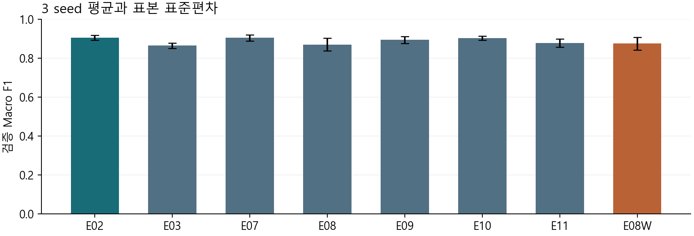
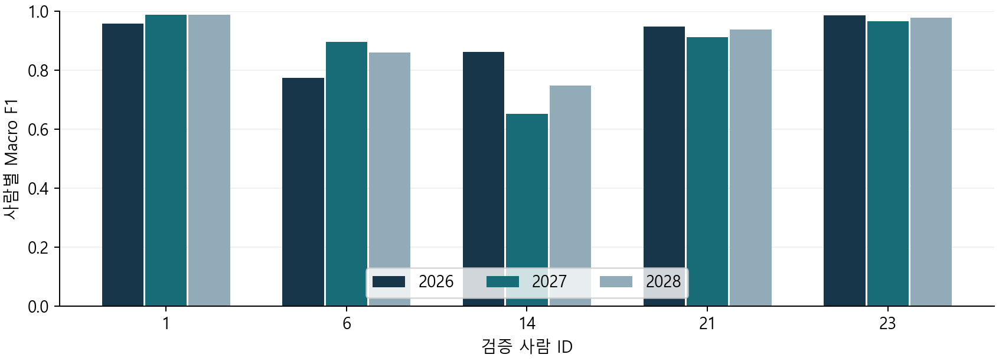

# 스마트폰 행동 인식 구현 과정 심화 보고서

이봉헌  |  담당 ② 기준모델 구현·공통 학습·조건 비교 및 팀장

보강 검증 및 작성일 2026년 9월 29일  |  이전 단일 seed 보고서의 후속 검증

## 핵심 결론

MLP의 성능표를 제시하는 데서 나아가 입력 계약의 취약점을 재현하고 수정하였다. 같은 seed가 동일 초기 가중치를 보장하지 않는다는 점도 실측하여, 가중치를 맞춘 Dropout 대조 실험을 추가하였다. 과정은 실제 결함, 의도적 오류 주입, 관찰 결과와 남은 한계를 구분해 기록하였다.

| 검증 축 | 보강 내용 |
| --- | --- |
| 실제 코드 결함 | 잘못된 분할 인덱스 및 원본·전처리 입력 불일치 차단 |
| 회귀 검사 | 신규 16개 검사: 수정 전 15실패 → 수정 후 통과; 기존 포함 24통과 |
| 수학 검증 | ReLU 46파라미터 × h 3종 = 138회 수치 비교 |
| 반복 학습 | 기존 7조건 × 3seed = 21회 및 초기값 일치 대조 3회 |
| 재현 근거 | 기존 seed 2026 예측 대조 및 새 저장 모델 재로딩 |

기존 7조건 중 검증 Macro F1 평균이 가장 높은 조건은 E02의 0.9046이었다. E02의 seed별 F1은 0.9138, 0.8906, 0.9094였다. 순위와 차이는 아래 본문에서 seed별로 함께 해석한다.

평균과 표준편차는 같은 검증 사람 5명에 대한 학습 변동을 나타낸다. 공식 test는 읽거나 평가하지 않았다. 오류가 전혀 없거나 다른 사람에게도 같은 성능이 나온다는 주장은 하지 않는다.

*주요 근거: reports/process_audit/summary.json, contracts_before.json, contracts_after.json, tests_after.xml. 실제 후속 실행은 모두 2026년 9월 29일 한국 시간에 수행했다.*

# 1 주장의 범위와 실제 작업 순서

과정 평가에서 중요한 것은 “문제가 있었다”는 문장 자체가 아니라 문제가 발생하는 입력, 원인, 수정 위치, 수정 후 확인 기준이다. 이번 보강은 기존 정상 UCI 학습과 외부 모듈 연결 시의 잘못된 입력을 분리해 점검하였다.

| 순서 | 수행과 판단 | 확인 근거 |
| --- | --- | --- |
| 1 | 기존 결과와 입력 계약 검토 | 기준 커밋 7aec3ac |
| 2 | 잘못된 입력을 수정 전 코드에 투입 | contracts_before.json |
| 3 | 실패를 고정하는 회귀 검사 작성·실행 | regressions_before.xml |
| 4 | 검사 시점과 내용 수정, 기존 검사도 실행 | 수정 커밋 47bc6f3 |
| 5 | 같은 seed의 Dense 초기값 직접 비교 | initialization_control.json |
| 6 | 대조 실험 계획을 결과 확인 전에 추가 | 계획 커밋 aaa5d3f |
| 7 | 21회 반복 + 3회 대조, 예측과 저장물 검증 | repeat_results.csv 및 재로딩 기록 |

## 세 종류의 증거를 구분

첫째, 잘못된 인덱스의 묵시적 변환과 원본 검증 입력 불일치는 실제 기존 코드에서 재현한 결함이다. 둘째, 배치 평균 나누기 누락이나 큰 logits의 naive softmax는 검사 능력을 보여 주기 위해 의도적으로 만든 대조이다. 셋째, seed별 성능 차이는 학습 변동의 관찰이며 소프트웨어 버그라고 부르지 않는다.

최초 7개 실험 전에 모든 후속 가설을 세웠다고 소급해 설명하지 않는다. 반복 실험 계획은 PROCESS_AUDIT_PLAN_KO.md에, 초기값 대조 추가 사유는 PROCESS_AUDIT_AMENDMENT_KO.md에 남겼다.

*Git 커밋은 파일 상태를 식별하고 실행 시각은 JSON에 기록한다. 수정 전후 계약 파일 SHA-256도 별도 남겨 커밋 전 수정 상태와 혼동하지 않게 하였다.*

# 2 실제 결함 하나 잘못된 분할 번호의 통과

외부 전처리 모듈이 제공하는 split_indices를 기존 prepare_data는 곧바로 np.asarray(..., dtype=np.int64)로 바꿨다. 이 동작은 값이 올바른 인덱스인지 확인하지 않고 소수를 잘라내거나 참거짓 값을 1과 0으로 해석한다. NumPy의 음수 인덱스도 배열 뒤쪽 행을 가리킨다.

| 입력 예 | 수정 전 실제 동작 | 수정 후 |
| --- | --- | --- |
| 0.8, 1.8, …, 5.8 | 행 0, 1, …, 5 선택 | 정수 벡터 오류 |
| −6, −5, …, −1 | 18행 fixture의 행 12–17 선택 | 범위 오류 |
| True, False | 행 1, 0 선택 | 정수 벡터 오류 |
| 18 | 배열 인덱싱 중 IndexError | 학습 준비 전 ValueError |
| 중복 행 또는 빈 배열 | 전처리 이후 또는 전처리 내부에서 실패 | 전처리 fit 전에 거부 |

## 원인과 수정

문제는 정수형 배열을 만들었다는 사실을 입력 검증으로 취급한 데 있었다. _row_indices에서 먼저 1차원·비어 있지 않음·정수형·0 이상·전체 행 수 미만·중복 없음 조건을 검사하고, 모두 통과한 뒤 int64로 바꿨다. unsigned 정수의 큰 값도 범위 검사 후 변환하여 overflow를 피한다.

## 기존 결과에 대한 영향 판단

공식 UCI 로더가 생성한 원래 분할은 이미 정상적인 정수 인덱스였다. 따라서 이 결함을 발견했다는 이유만으로 이전 HAR 점수가 잘못되었다고 결론 내리지 않았다. 수정한 코드로 seed 2026의 7조건을 다시 학습해 이전 예측과 직접 대조하였다.

*최소 재현: analysis/process_audit/contract_probe.py. 합성 18행 자료를 사용한 경계 검사이며 해당 fixture의 결과를 HAR 정확도로 표시하지 않는다.*

# 3 실제 결함 둘 원본과 모델 입력의 정렬

TrainingData는 학습에 사용하는 x_validation과 저장물 재현에 사용하는 raw_validation을 함께 가진다. 기존 검사는 두 자료의 행 수만 비교했다. 행 수를 유지한 채 원본 행 순서를 뒤집으면 이 검사를 통과했다.

| 단계 | 관찰 |
| --- | --- |
| 정상 입력 | 저장 전처리로 원본을 변환하면 모델 입력과 차이 0 |
| 원본 행 역순 변경 | 검사 통과, 변환 결과와 입력의 최대 절대 차이 11.6729 |
| 수정 | 저장 전처리 상태로 raw_validation을 재변환해 전체 shape·유한값·값 비교 |
| 수정 후 | 동일 역순 입력은 명확한 ValueError로 거부 |

비교 허용오차는 rtol=10⁻⁵, atol=10⁻⁶이다. 참조 어댑터에서는 동일 연산의 출력이므로 차이가 0이지만, 외부 모듈 연결 시 작은 부동소수점 차이를 허용하도록 했다. 반면 큰 값 차이와 행 순서 변경을 허용오차로 덮지 않는다.

## 사람 ID와 검사 시점

사람 ID는 양의 정수 1차원 벡터인지 추가 확인한다. 학습과 검증 사람의 교집합 검사는 전처리 fit 이전으로 이동하였다. 학습이 끝난 뒤 실패를 알아내는 것보다, 잘못된 자료가 통계를 만드는 단계에 들어가기 전에 차단하는 편이 원인 진단에 유리하다.

## 보장하지 못하는 것

이 검사는 전달된 원본과 전처리 결과의 자기 일관성을 확인한다. 원본과 ID가 함께 잘못 바뀌었거나 채널 이름만 틀리게 붙은 경우의 진실성까지 증명하지 않는다. 원본 UCI 행과 채널 순서는 별도 로더·재로딩 검증에서 대조한다.

*수정 위치: src/contracts.py의 TrainingData.validate 및 prepare_data. 잘못된 전처리 평균을 주입한 경우도 회귀 검사에서 거부됨을 확인하였다.*

# 4 회귀 검사를 설계한 이유와 결과

회귀 검사는 수정 내용을 그대로 다시 써서 통과시키는 코드가 아니라, 수정 전 결함이 드러나는 외부 입력을 고정하는 방식으로 작성하였다. 특히 잘못된 분할에서 Preprocessor.fit이 호출되면 실패하게 하는 감시 함수를 사용해 오류 차단 시점도 검사했다.

| 검사 묶음 | 사례 수 | 요구 동작 |
| --- | --- | --- |
| 분할 인덱스 | 9 | 소수·음수·bool·중복·범위·빈 배열·차원·큰 unsigned 거부 |
| 검증 원본 연결 | 2 | 역순 원본 및 잘못된 전처리 상태 거부 |
| 사람 ID 형태 | 3 | 소수·음수·2차원 ID 거부 |
| 검증 분포 변형 | 1 | 검증 값에 10,000을 더해도 학습 통계·학습 입력 동일 |
| 사람 중복 검사 시점 | 1 | 전처리 fit 전에 중복 사람 거부 |

| 실행 | 결과 | 해석 |
| --- | --- | --- |
| 수정 전 신규 검사 | 15실패 / 1통과 | 새로 정한 계약과 맞지 않는 경로 재현 |
| 수정 후 전체 검사 | 24통과 | 신규 16개 + 기존 8개 모두 통과 |

15개 실패를 독립된 버그 15개라고 세지 않는다. 같은 원인을 여러 경계 입력과 검사 시점에서 확인한 것이다. 기존 학습·모델 저장·외부 모델 연결 검사를 함께 실행하여 새 방어 장치가 정상 경로를 깨뜨리지 않는지도 확인하였다.

*pytest 실행에는 라이브러리 deprecation 경고 26개가 있었으나 실패는 없었다. 경고가 존재한다는 사실을 숨기거나 모든 의존성 문제까지 해결했다고 표시하지 않는다.*

# 5 같은 seed가 같은 초기값을 뜻하는가

처음 반복 실험은 모든 조건에 seed 2026·2027·2028을 적용하는 방식으로 통제했다. 이후 Dropout 구조를 실제로 생성해 Dense 가중치를 비교하자 첫 층은 같았지만 둘째 층과 출력층은 달랐다. 모델 생성 과정에서 사용하는 난수의 순서가 구조 변경에 영향을 받을 수 있다는 점을 실측으로 확인한 것이다.

| seed | hidden 1 차이 | hidden 2 최대 차이 | 출력층 최대 차이 |
| --- | --- | --- | --- |
| 2026 | 0 | 0.348673 | 0.551879 |
| 2027 | 0 | 0.349673 | 0.558990 |
| 2028 | 0 | 0.351655 | 0.568069 |

## 이 발견이 바꾸는 주장

E02와 E08의 비교는 같은 seed를 사용한 설정 비교로는 유효하다. 그러나 초기 가중치까지 같은 상태에서 Dropout만 바뀌었다고 표현하면 실제 코드와 맞지 않는다. 이 때문에 기존 E08 결과만으로 Dropout 자체가 성능을 낮췄다는 인과적 결론을 내리지 않았다.

## 대안 비교

대안 하나는 각 Dense 초기화에 별도의 명시적 seed를 주는 것이다. 다른 대안은 기준모델의 초기 가중치를 이름으로 대응되는 층에 복사하는 것이다. 이번 대조에서는 현재 모델 구현을 유지하면서 초기값 일치를 직접 검증하기 쉬운 두 번째 방법을 선택했다.

결과를 본 뒤 유리한 seed를 골라 다시 실행하지 않았다. 초기값 검사 결과에 따라 추가 대조 계획을 기록하고, 기존과 같은 seed 세 개 모두에서 E08W를 실행하였다.

*초기값 검사는 학습 전 배열의 완전 일치를 비교했다. 파일: initialization_control.json. 원인에 대한 설명과 실제 관찰한 가중치 차이를 구분한다.*

# 6 초기 가중치를 맞춘 Dropout 대조

E08W는 Dropout 0.3인 E08과 구조·학습 설정이 같다. 각 seed에서 E02를 생성한 직후 Dense 층의 가중치와 편향을 저장하고, 같은 seed로 만든 Dropout 모델의 대응 층에 복사했다. 학습 전에 모든 배열이 동일함을 확인하고 초기값 해시를 남겼다.

| seed | E02 F1 | E08 F1 | E08W F1 | E08W−E02 |
| --- | --- | --- | --- | --- |
| 2026 | 0.9138 | 0.8940 | 0.8968 | -1.70%p |
| 2027 | 0.8906 | 0.8810 | 0.8373 | -5.33%p |
| 2028 | 0.9094 | 0.8320 | 0.8878 | -2.15%p |

E08W의 평균 Macro F1은 0.8740, 표본 표준편차는 0.0321였다. E02 대비 평균 차이는 -3.06%p이다. 기존 E08 평균 0.8690도 함께 보아 초기값 통제 전후의 관찰이 어떻게 달라지는지 확인한다.

## 대조의 의미와 남은 차이

처음 Dense 파라미터가 같다는 조건은 확보했다. 학습 중 Dropout 마스크, 이후 가중치 변화, 조기 종료 시점은 여전히 달라진다. 이는 Dropout을 사용하는 학습 방법의 일부이며 제거해야 할 우연한 초기값 차이와 구분한다.

세 번의 결과로 모든 데이터와 모델에서 Dropout의 효과를 일반화할 수 없다. 비율 0.3, 현재 네트워크, 현재 검증 사람과 학습 예산에서 얻은 추가 증거로 보고한다. 대조 결과를 기존 7조건의 사전 계획 결과와 섞어 최적 모델 탐색의 범위를 숨기지 않는다.

*실행 소스: analysis/process_audit/run_matched_dropout.py. 실행별 initialization_match.json에 초기값 일치, 해시, 추가 계획 파일의 해시를 기록하였다.*

# 7 데이터 분할과 누출 검사의 범위

| 자료 | 사람 수 | 표본 수 | 역할 |
| --- | --- | --- | --- |
| fit | 16 | 5,577 | 추가 표준화·PCA fit 및 가중치 갱신 |
| validation | 5 | 1,775 | 조기 종료와 조건 비교 |
| official test | 9 | 2,947 | 읽거나 평가하지 않음 |

검증 사람은 1·6·14·21·23이다. UCI 창은 50 Hz의 128시점, 즉 2.56초이며 50% 중첩된다. 같은 사람의 비슷한 창이 학습과 검증에 섞이지 않도록 사람을 기준으로 나눴다. 1,775개의 창을 서로 완전히 독립된 1,775명처럼 해석하지 않는다. [1]

## 무엇을 fit했는가

특징은 561개 열별로, 시계열은 표본·시간 축을 합친 9개 채널별로 학습 통계를 구한다. PCA도 표준화한 학습 특징에만 fit한다. E11의 100차원은 이 분할에서 설명분산 95%를 만족한 결과이며 분류 정확도 95%와 다르다.

## 검증 분포를 바꾼 불변성 검사

검증 입력에 큰 상수를 더하는 변형을 적용했을 때 학습 평균·표준편차와 학습 전처리 결과가 완전히 같은지 확인했다. 이는 prepare_data가 검증 값을 학습 통계 계산에 사용하지 않는다는 검사다. UCI가 이미 제공한 특징의 생성 과정 전체나 미래 팀원 코드의 모든 누출 가능성까지 보장하지 않는다.

공식 test를 마지막까지 남긴 이유는 검증 결과로 조건을 고르는 과정 자체가 선택 편향을 만들기 때문이다. 후속 최종 평가에서 test를 확인한 뒤 다시 그 점수에 맞춰 조건을 바꾸면 새로운 독립 평가가 필요하다.

*원 자료: UCI HAR, DOI 10.24432/C54S4K, CC BY 4.0. 사람 분할과 변환 범위는 원본 행 ID 및 저장된 split.json으로 추적한다.*

# 8 실제 MLP의 순전파와 배열 크기

이하 식은 E02의 두 은닉층 MLP를 행 우선 배치 표기로 나타낸 것이다. B는 배치 크기이고 마지막 차원은 특징 또는 뉴런 수이다. 학습은 TensorFlow·Keras 자동미분으로 수행하며 별도 작은 신경망에서 수학식 구현을 검증한다.

| 기호 | shape | 역할 |
| --- | --- | --- |
| X | B × 561 | 표준화한 입력 |
| W₁ / b₁ | 561 × 128 / 128 | 첫 Dense |
| H₁ | B × 128 | 첫 ReLU 출력 |
| W₂ / b₂ | 128 × 64 / 64 | 둘째 Dense |
| H₂ | B × 64 | 둘째 ReLU 출력 |
| W₃ / b₃ | 64 × 6 / 6 | 행동 logits |

`A1=XW1+b1; H1=ReLU(A1)`

`A2=H1W2+b2; H2=ReLU(A2)`

`Z=H2W3+b3`

편향은 배치의 모든 행에 broadcast한다. 파라미터 수는 71,936 + 8,256 + 390 = 80,582이다. 마지막 층에 softmax를 넣지 않고 logits를 반환하며 손실에 from_logits=True를 지정한다.

E03은 128×9를 1,152차원으로 펼쳐 같은 은닉층에 넣으며 파라미터는 156,230개다. E11은 PCA 100차원으로 입력을 줄여 21,574개다. 입력 표현과 모델 용량이 함께 변하므로 E02와의 차이를 표현 한 가지의 효과라고 말하지 않는다.

*핵심 구현: src/models/mlp.py, src/train.py. 전치·배치 축·편향 broadcast를 구분하면 역전파 식의 shape도 직접 검산할 수 있다.*

# 9 교차엔트로피 역전파와 Adam

Y를 정답 one-hot 행렬, P를 각 행의 softmax 확률이라고 둔다. 손실은 B개 표본의 교차엔트로피 평균이다. 자동미분을 사용하더라도 어떤 미분을 계산하는지는 아래 식으로 설명할 수 있어야 한다.

`L=−(1/B) Σ_i log P[i,y_i]`

`D3=(P−Y)/B; dL/dW3=H2ᵀD3`

`D2=(D3W3ᵀ) ⊙ 1[A2>0]`

`dL/dW2=H1ᵀD2; dL/db2=Σ_i D2[i]`

첫 층에도 같은 연쇄법칙을 적용한다. ReLU 마스크는 순전파 때의 preactivation A가 양수인지로 결정한다. 편향 미분은 배치 축으로 합하며, 평균 손실의 1/B는 D₃에 한 번만 포함한다. 이를 빠뜨리거나 각 층에서 중복 적용하면 잘못된 기울기가 된다.

## 역전파와 옵티마이저의 구분

역전파는 g=∂L/∂θ를 구한다. Adam은 기울기의 1차·2차 모멘트 이동평균과 편향 보정을 사용해 θ를 갱신한다. 실제 설정은 learning_rate=0.001, β₁=0.9, β₂=0.999, ε=10⁻⁷이며 E09·E10에서 학습률만 바꾼다.

손계산 예제의 SGD 한 번과 실제 HAR의 Adam 학습을 같은 갱신으로 설명하지 않는다. 또한 학습 손실은 각 배치가 처리될 당시 가중치에서 집계되고 검증은 epoch 말 가중치로 평가되므로, 두 손실의 차이를 단순한 동일 조건의 오차 차이라고 볼 수 없다.

*TensorFlow는 logits 기반 교차엔트로피에 내부 softmax 처리를 포함한다. 근거 [2]. 전체 HAR MLP의 수동 역전파 구현을 완료했다고 주장하지 않는다.*

# 10 ReLU 네트워크의 수치 미분 검증

기존 tanh 검증에 더해 실제 기준모델과 같은 ReLU·6개 logits·교차엔트로피 평균을 사용하는 3 → 4 → 6 네트워크를 구성했다. 배치는 8개, 파라미터는 46개다. NumPy 역전파, TensorFlow 자동미분, 중심차분을 비교했다.

`central difference=(L(theta+h)−L(theta−h))/(2h)`

| h | 최대 상대 오차 | 검사 수 |
| --- | --- | --- |
| 0.001 | 1.4878e-06 | 46 |
| 0.0001 | 1.4874e-08 | 46 |
| 1e-05 | 5.7939e-09 | 46 |

총 138회 비교를 수행했다. NumPy와 TensorFlow의 최대 절대 오차는 4.1633e-17였다. 숨은층 preactivation의 최소 절댓값은 0.039580로, 이 검사는 ReLU의 0 근처 비미분점과 떨어진 입력에서 수행했다.

## 검사 도구도 잘못 판단할 수 있는 경우

ReLU(0)의 중심차분은 h가 양수일 때 0.5가 된다. TensorFlow는 x=0에서 0을 선택한다. 이 차이는 TensorFlow의 버그라는 뜻이 아니다. 0에서 고전적인 미분계수가 유일하게 존재하지 않기 때문이다. 수치 미분 검사는 비미분점 여부와 h 크기를 고려해 해석해야 한다.

## 오류를 실제로 잡는지 확인

평균 손실의 미분에서 의도적으로 /B를 빠뜨리면 이 배치에서는 기울기 norm이 정확히 8배가 된다. 자동미분과의 비교가 실패하는 것을 확인했다. 합계 손실을 일관되게 정의한 경우의 8배 기울기는 다른 목적함수의 올바른 미분이므로, 목적함수와 미분을 함께 확인한다.

*math_controls.json. 이 장의 잘못된 미분은 검사 능력을 확인하기 위해 의도적으로 주입한 대조이며, 기존 HAR 학습에 그 오류가 있었다고 서술하지 않는다.*

# 11 softmax 안정화와 확률의 함정

큰 logits에 exp를 바로 적용하는 naive softmax는 overflow를 일으킬 수 있다. [1000, 1001, 999, −1000, 0, 1002]를 넣는 의도적 대조에서 4개 확률 값이 비유한 값이 되었다. 각 행의 최댓값을 뺀 뒤 계산하면 모든 확률이 유한하고 합은 1이 된다.

`Pik=exp(Zik−max_j Zij)/sum_j exp(Zij−max_j Zij)`

| 계산 | 실제 관찰 | 해석 |
| --- | --- | --- |
| naive exp / 합 | 비유한 값 4개 | 큰 exp 값의 overflow |
| 최댓값을 뺀 softmax | 합 1.0, 최댓값 클래스 5 | 확률 계산의 안정성 개선 |
| 클래스 3의 확률 | 0.0 | 매우 작은 확률의 underflow는 남음 |
| logits 기반 교차엔트로피 | 2002.440190 | 클래스 3이 정답이어도 유한한 손실 |

## 확률이 유한하면 손실도 안전한가

아니다. 매우 작은 확률이 0으로 반올림되면 −log(0)은 무한대가 된다. 따라서 학습 손실은 softmax 확률을 따로 구해 로그를 취하는 대신 logits의 logsumexp 형태로 계산한다. TensorFlow의 logits 기반 교차엔트로피와 NumPy logsumexp 계산이 일치함을 확인했다.

`sample CE=logsumexp(Z)−Z[true_class]`

이 대조는 현재 구현의 안정적 softmax와 from_logits=True 선택을 설명하는 근거다. 큰 logits가 실제 HAR 학습에서 발생해 모델이 실패했다는 사례로 바꾸어 말하지 않는다.

*근거: math_controls.py 및 math_controls.json. 예측용 확률 계산과 학습용 안정적 손실 계산은 서로 연결되지만 동일한 수치 절차가 아니다.*

# 12 반복 실험의 계획과 통계 해석

기존 7조건을 seed 2026·2027·2028에서 각각 다시 학습했다. 이후 초기값 검사에 따라 E08W 세 번을 추가했다. 따라서 이번에 새로 수행한 학습은 21+3=24회이다. 최초 v1의 7회와 혼동하지 않도록 별도 실행 폴더를 사용한다.

| 통제 항목 | 유지한 값 |
| --- | --- |
| 사람 분할 | fit 16명 / validation 5명, 검증 ID 고정 |
| 전처리 | fit 자료만 통계·PCA 계산 |
| 학습 | batch 64, 최대 40 epoch, Adam |
| 중단과 복원 | val_loss 최소, patience 6, 최선 가중치 복원 |
| 실행 | 조건·seed마다 새 Python 프로세스 |
| 보고 지표 | Accuracy, 6클래스 Macro F1, 평균과 표본 SD |

`mean=sum(F1)/3; sample SD=sqrt(sum((F1−mean)^2)/2)`

표준편차는 ddof=1로 계산했다. 이것은 같은 검증 사람에서 초기화·셔플 등 학습 과정의 변동을 나타낸다. 다른 사람을 다시 뽑았을 때의 불확실성이나 모집단 신뢰구간은 아니다. seed가 세 개뿐이므로 유의성 검정이나 통계적 우월성을 제시하지 않는다.

시계열과 PCA는 입력 차원과 파라미터 수가 함께 변한다. 학습률 비교도 조기 종료와 상호작용한다. 동일 설정의 의미를 “모든 조건이 동일한 학습 경로를 가진다”로 확대하지 않는다. 이번 실행 시간은 별도 속도 벤치마크로 사용하지 않는다.

*7조건 계획과 초기값 대조 추가 계획은 별도 문서·커밋으로 보존했다. 유리한 seed만 보고하는 선택을 피하기 위해 세 seed의 결과를 모두 제시한다.*

# 13 반복 실험의 전체 결과

*E02 특징 기준 / E03 시계열 / E07 추가 표준화 없음 / E08 Dropout 0.3 / E09 학습률 0.0003 / E10 학습률 0.003 / E11 PCA 95% / E08W 초기값 일치 Dropout*

| 조건 | Macro F1 평균 | 표본 SD | Accuracy 평균 | 파라미터 |
| --- | --- | --- | --- | --- |
| E02 | 0.9046 | 0.0123 | 0.9061 | 80,582 |
| E03 | 0.8635 | 0.0140 | 0.8657 | 156,230 |
| E07 | 0.9034 | 0.0160 | 0.9044 | 80,582 |
| E08 | 0.8690 | 0.0327 | 0.8719 | 80,582 |
| E09 | 0.8931 | 0.0178 | 0.8948 | 80,582 |
| E10 | 0.9021 | 0.0106 | 0.9033 | 80,582 |
| E11 | 0.8771 | 0.0209 | 0.8792 | 21,574 |
| E08W | 0.8740 | 0.0321 | 0.8768 | 80,582 |

*그림 1. 3seed 평균 Macro F1. E08W는 초기값 검사 후 추가한 별도 대조 조건이다.*

기존 7조건의 최고 평균은 E02(0.9046)이었다. 평균의 작은 차이만 보고 순위를 확정하기보다 다음 장의 seed별 변화와 대조 실험을 함께 보아야 한다. E08W는 본래 7조건과 구분해 표시한다.

*원래 정밀도 수치: condition_summary.csv, repeat_results.csv. 표의 SD는 표본 표준편차이며 평균의 신뢰구간으로 읽지 않는다.*

# 14 seed별 비교가 바꾸는 결론

| 조건 | seed 2026 | seed 2027 | seed 2028 | 평균 차이 |
| --- | --- | --- | --- | --- |
| E03 | -3.73 | -2.55 | -6.06 | -4.11 |
| E07 | -2.74 | +1.50 | +0.88 | -0.12 |
| E08 | -1.99 | -0.96 | -7.74 | -3.56 |
| E09 | -3.90 | +0.33 | +0.12 | -1.15 |
| E10 | -2.40 | +1.77 | -0.12 | -0.25 |
| E11 | -3.43 | -3.56 | -1.28 | -2.76 |
| E08W | -1.70 | -5.33 | -2.15 | -3.06 |

*단위: E02 대비 Macro F1 차이(%p). 양수는 해당 seed에서 E02보다 높다는 뜻이다. E08W는 초기 가중치 일치 대조다.*

seed 2026에서는 E02가 기존 7조건 중 최고였다. 그러나 seed 2027에서는 E07·E09·E10이 E02보다 높았다. 따라서 “추가 표준화나 기본 학습률이 항상 가장 좋다”는 설명은 결과와 맞지 않는다. 고정된 검증 분할에서도 학습 초기화와 경로에 따라 비교 결과가 달라진다.

## 평균 차이와 paired 비교

같은 seed끼리 차이를 계산하면 결과를 대응시켜 볼 수 있지만, seed 숫자가 같다고 두 구조의 모든 난수와 초기값이 같지는 않다. E08W는 그중 초기 Dense 가중치 차이를 제거한 추가 대조다. 대응 차이는 기술통계로 제시하며 n=3에서 신뢰할 만한 유의성 결론으로 확대하지 않는다.

## 업데이트한 주장

기준모델로 E02를 제공한 이유는 설명하기 쉬운 구조와 실제 기준 성능을 확보하기 위해서다. “어떤 조건에서도 최강인 모델”을 만들었다는 의미는 아니다. 결과가 달라진 사례도 전체 표에 남기는 것이 설계와 해석의 신뢰성을 높인다.

*원본: paired_deltas.csv. 이 표는 실제 관찰값에 따른 설명이며 결과에 맞춰 가설을 사전에 세웠던 것처럼 바꾸지 않는다.*

# 15 사람별 성능과 표본 독립성

| 사람 ID | 창 수 | F1 2026 | F1 2027 | F1 2028 |
| --- | --- | --- | --- | --- |
| 1 | 347 | 0.9567 | 0.9866 | 0.9868 |
| 6 | 325 | 0.7740 | 0.8945 | 0.8586 |
| 14 | 323 | 0.8613 | 0.6520 | 0.7469 |
| 21 | 408 | 0.9480 | 0.9107 | 0.9363 |
| 23 | 372 | 0.9848 | 0.9651 | 0.9774 |

*그림 2. E02의 사람별 Macro F1. 각 사람의 세 seed를 모두 표시하였다.*

전체 창을 합쳐 계산한 Macro F1과 사람별 Macro F1의 단순 평균은 다른 집계다. 전자는 클래스별 F1을 전체 표본에서 구하고, 후자는 사람별 성능을 같은 비중으로 평균한다. 어느 값을 사용했는지 명시해야 한다.

현재 사람별 결과는 검증 대상 5명의 차이를 드러내는 보조 분석이다. 시간 창을 독립 표본으로 취급한 신뢰구간을 제시하지 않았다. 새로운 사람에 대한 불확실성은 더 많은 사람 분할이나 그룹 교차검증으로 후속 확인해야 한다.

*각 검증 사람에게 6개 클래스가 모두 존재함을 함께 확인했다. 데이터: e02_by_subject.csv. 공식 test 사람은 분석에 포함하지 않는다.*

# 16 조기 종료와 손실 순위의 차이

| 조건 seed | 최선/실행 epoch | 최소 val loss | Macro F1 |
| --- | --- | --- | --- |
| E02 2026 | 2/8 | 0.2847 | 0.9138 |
| E02 2027 | 4/10 | 0.4349 | 0.8906 |
| E02 2028 | 2/8 | 0.3068 | 0.9094 |
| E07 2026 | 2/8 | 0.2651 | 0.8864 |
| E07 2027 | 8/14 | 0.3314 | 0.9056 |
| E07 2028 | 9/15 | 0.2821 | 0.9182 |

seed 2026의 E02는 epoch 2의 검증 손실이 최소였고, 이후 6개 epoch에서 개선되지 않아 epoch 8에 종료했다. “종료 epoch”와 “선택 epoch”는 다르다. 최종 평가와 모델 저장은 복원한 최선 가중치로 수행했다.

## 손실이 더 낮은데 F1은 낮을 수 있는가

E07 seed 2026의 검증 손실 0.2651은 E02의 0.2847보다 작지만 Macro F1은 더 낮다. 교차엔트로피는 정답 확률의 로그를 평가하고 F1은 argmax 예측의 정밀도·재현율을 평가한다. 두 지표는 같은 대상을 같은 방식으로 측정하지 않는다.

## 왜 F1으로 epoch를 고르지 않았는가

처음 정한 val_loss 선택 규칙을 반복 실험에도 유지했다. 결과를 보고 각 실행마다 유리한 지표로 선택 기준을 바꾸지 않았다. F1을 기준으로 선택하는 정책을 비교하려면 그 규칙을 별도 조건으로 정의하고 같은 범위의 실험을 수행해야 한다.

*표는 history.csv와 metrics.json에서 생성했다. Keras EarlyStopping의 restore_best_weights는 최선 모델 가중치를 복원한다. 옵티마이저까지 해당 epoch로 복원하는 체크포인트와 구분한다. [3]*

# 17 재학습 재현과 저장물 재로딩

| 검사 | 대상 | 확인 결과 |
| --- | --- | --- |
| 수정 전후 재학습 | seed 2026, 7조건 × 1,775개 | 이전 예측과 클래스·확률 완전 일치 |
| 새 저장물 재로딩 | 새 학습 24개 모델 | 원본 검증 입력에서 전체 예측 재계산 |
| 전처리·모델 식별 | 각 실행의 SHA-256 | 저장 파일과 메타데이터 해시 확인 |
| 코드 식별 | 24실행의 학습 코드 해시 | 동일 src·configs·scripts 바이트 해시 |

재학습 재현은 같은 seed와 정상 입력에서 수정 전후 결과가 변하지 않았는지를 확인한다. 재로딩 재현은 저장한 전처리와 모델이 같은 검증 예측을 만드는지를 확인한다. 두 검사는 서로 다른 실패 가능성을 다룬다.

## 정확히 보존한 범위

전처리 통계·PCA, 모델 파일, 설정, 표본 ID와 사람 분할, epoch 로그, 표본별 예측을 실행 묶음으로 저장했다. 새로 학습한 모델은 runs/process_repeats와 runs/process_matched로 구분하여 원래 runs/formal을 덮어쓰지 않았다.

## 저장 모델의 한계

현재 저장물은 compile=False로 불러 추론·평가하는 용도다. 조기 종료에서 복원한 최선 가중치와 옵티마이저의 마지막 상태는 같은 epoch가 아닐 수 있으므로 정확한 학습 재개를 보장하지 않는다. 이를 해결하려면 최선 시점의 전체 모델·옵티마이저를 함께 저장하고 재개 후 다음 스텝까지 별도로 비교해야 한다.

*재학습 대조: summary.json의 original_seed_replay. 새 프로세스 재로딩: reload_repeats.json 및 reload_matched.json. 현재 장치와 라이브러리 환경에서 확인한 결과다.*

# 18 제거한 약점과 남아 있는 한계

| 쟁점 | 이번에 보강한 근거 | 여전히 남는 범위 |
| --- | --- | --- |
| 분할 번호 오류 | 정수·범위·중복 검사 | 외부 원본 ID의 의미적 진실성 |
| 원본과 모델 입력 불일치 | 전처리 재적용 비교 | 두 자료가 함께 잘못된 경우 |
| 단일 seed의 우연 | 7조건 × 3seed | seed 3개 및 고정된 사람 5명 |
| Dropout 초기값 혼동 | 가중치 일치 대조 3회 | Dropout 비율·모델 구조 일반화 |
| 수학 검증 범위 | ReLU 46파라미터 138검사 | 전체 모델의 모든 입력·비미분점 |
| 모델 전달 실패 | 24모델 재로딩 검사 | 다른 장치·실제 시연·학습 재개 |

비판할 부분을 숨기는 대신 어떤 주장에 어떤 증거가 대응하는지를 정리하였다. 예를 들어 “모든 오류를 없앴다”는 결론은 테스트로 입증할 수 없다. “정의한 잘못된 분할과 정렬 입력을 학습 전에 거부하고 정상 UCI 재학습 결과를 유지했다”는 결론은 현재 증거로 뒷받침할 수 있다.

## 후속 실험의 우선순위

① 팀 공식 전처리의 ID·채널·수치 대조, ③ 실제 비교 모델 연결, ④ 반복 사람 분할 및 최종 시험 평가, ⑤ 실제 추론 경로·장치 지연 시간 검증으로 이어간다. 현재의 저장물 검사와 인터페이스 준비를 실제 팀 통합 완료로 표현하지 않는다.

*이 보고서의 목적은 반론을 원천 봉쇄하는 것이 아니라 반론에 답할 검증 근거와 결론의 경계를 명확히 하는 것이다.*

# 19 발표에서 짚고 넘어갈 질문

| 질문 | 답변의 핵심과 근거 |
| --- | --- |
| 같은 seed면 초기값도 같은가? | 구조 변경 시 그렇지 않았다. Dense 배열을 비교하고 E08W에서 복사·동일성을 확인했다. |
| ReLU 수치미분 0.5, 자동미분 0이면 버그인가? | 0은 비미분점이다. 중심차분과 선택한 subgradient의 차이를 검사 실패와 구분한다. |
| softmax 확률이 유한하면 로그 손실도 안전한가? | 아니다. 정답 확률이 0으로 underflow될 수 있다. logits의 logsumexp 손실을 사용한다. |
| 24개 테스트가 모든 버그가 없다는 증거인가? | 정의한 입력과 경계 경로에서의 검사다. 원본 의미·모든 환경까지 증명하지 않는다. |
| 3seed 평균이 다른 사람에서도 좋은가? | 현재 분할의 학습 변동만 본 것이다. 새 사람 분할의 일반화는 추가 평가가 필요하다. |
| 수정한 뒤 과거 점수를 그대로 쓴 것 아닌가? | seed 2026의 7조건을 재학습해 1,775개 예측을 각각 원본 기록과 대조했다. |

질문을 유도할 때에는 표나 문장을 일부러 틀리게 쓰지 않는다. 예를 들어 “seed는 같게 고정했습니다. 다만 이것만으로 초기값도 같을까요?”를 먼저 묻고, 실제 초기값 비교와 대조 실험을 보여 주면 검증 과정 자체가 설명의 중심이 된다.

답변은 주장 → 근거 파일 또는 수치 → 적용 범위 순으로 한다. 모르는 질문에는 현재 검증하지 않은 범위를 밝히고 어떤 추가 실험으로 답할지 제안한다. 하지 않은 실험을 했다고 답하는 것보다 자료와 결론을 일치시키는 편이 방어력이 높다.

*별도 DEFENSE_QA_KO.md에는 수학·코드·실험·재현·협업 질문에 대한 확장 답변과 말하면 안 되는 과장 표현을 정리했다.*

# 20 재현 명령과 참고자료

기존 실행 안내로 환경과 UCI 자료를 준비한 다음, 저장소 루트에서 아래 모듈을 실행한다. 기록된 실행 폴더는 덮어쓰지 않으므로 새 작업 복사본이나 새로운 출력 경로를 사용한다. 21회 반복 스크립트의 데이터 경로는 인자로 명시할 수 있다.

| 목적 | 실행 진입점 |
| --- | --- |
| 전체 회귀 검사 | python -m pytest tests -q |
| 입력 계약 대조 | python analysis/process_audit/contract_probe.py --phase after --output <JSON 경로> |
| 수학 대조 | python analysis/process_audit/math_controls.py |
| 7조건 반복 | python analysis/process_audit/run_repeats.py <UCI HAR Dataset 경로> |
| 초기값 대조 | python analysis/process_audit/run_matched_dropout.py --seed 2026 --data-root <자료 경로> |
| 수치 집계 | python analysis/process_audit/summarize.py |

재현 환경은 Python 3.11.9, TensorFlow 2.21.0, Keras 3.15.1, NumPy 2.2.6, scikit-learn 1.7.2이다. 스레드·seed·결정적 연산 설정을 기록하고 oneDNN을 비활성화했다. 현재 환경에서 얻은 일치를 모든 하드웨어의 비트 단위 일치로 일반화하지 않는다.

## 참고자료

*[1] UCI Human Activity Recognition Using Smartphones, DOI 10.24432/C54S4K. https://archive.ics.uci.edu/dataset/240/human+activity+recognition+using+smartphones*

*[2] TensorFlow, softmax_cross_entropy_with_logits 및 자동미분 안내. https://www.tensorflow.org/api_docs/python/tf/nn/softmax_cross_entropy_with_logits · https://www.tensorflow.org/guide/autodiff*

*[3] Keras, EarlyStopping. https://keras.io/api/callbacks/early_stopping/*

*[4] 프로젝트 소스와 실제 실행 근거. https://github.com/kara320090/smartphone-har · reports/process_audit/*

*[5] 제공된 스마트폰 행동인식 10주 상세계획서 및 역할표. 담당 범위의 근거로 사용하였다.*
