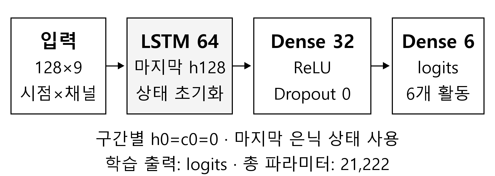

# 이봉헌 LSTM 논문 삽입용 압축 원고

공동 논문 전체가 그림·표·참고문헌을 포함해 1~2쪽이므로 LSTM 부분만 압축했다. 아래 본문은 독립 논문이 아니라 팀 원고에 삽입하는 기여 문단이다. 다른 모델의 구조와 점수는 아직 작성하지 않았다.

## 기본 삽입 본문

### LSTM 모델

LSTM[2,3]은 표준화된 128×9 입력을 순차 처리하고, 구간마다 은닉·셀 상태를 0으로 초기화하였다. 마지막 은닉 상태를 Dense 32 ReLU와 6개 logits에 연결하였다(그림 1). 은닉 크기는 64, 총 파라미터는 21,222개이다.

Adam 0.001, batch 64, 최대 40 epoch로 학습하고 validation loss 기준 patience 6으로 최선 가중치를 복원하였다. seed 2026·2027·2028에서 반복하였다.

### LSTM 결과

개발용 validation Macro F1은 0.8813±0.0195, Accuracy는 0.8832±0.0194였다. ±는 세 seed의 표본 SD이다. 저장 모델 재로딩 예측을 검증했으며, 공식 test는 평가하지 않았다.

본문 합계는 공백 포함 381자이다. 절 제목·그림·표·참고문헌은 이 문자 수에 포함하지 않았다. 실제 지면은 줄바꿈과 편집 서식에 따라 달라진다.

## 지면이 부족할 때 사용할 더 짧은 본문

LSTM[2,3]은 128×9 입력에서 구간별 상태를 0으로 초기화하고 마지막 은닉 상태를 분류에 사용하였다. LSTM 64→Dense 32 ReLU→6 logits 구조의 파라미터는 21,222개이다(그림 1).

L01의 개발용 validation Macro F1은 0.8813±0.0195, Accuracy 평균은 0.8832였다. ±는 세 seed의 표본 SD이며 공식 test 성능이 아니다.

공백 포함 222자이다. 이 버전을 쓸 때 학습 설정과 validation의 epoch 선택 사용 사실은 공동 실험 절에서 한 번 설명해야 한다. 다른 모델도 실제로 같은 조건을 썼는지 확인한 뒤 공통 조건으로 표기한다.

## 구조 그림

**그림 제목:** 그림 1. 기본 LSTM 모델의 구조

현재 그림은 L01의 실제 구조를 나타낸다. Dropout은 Dense 뒤 p=0이며 LSTM 내부 Dropout과 recurrent Dropout도 0이다. 출력은 softmax를 포함하지 않는 logits이다. HWP에는 가로 80 mm로 삽입했으며 고해상도 PNG와 SVG를 함께 제공한다. 그림 번호는 최종 취합 후 바꾼다.

## 통합 비교표에 넣을 한 행

| 모델 | 반복 | 파라미터 | validation Accuracy 평균 ± 표본 SD | validation Macro F1 평균 ± 표본 SD |
| --- | ---: | ---: | ---: | ---: |
| LSTM L01 | 3 | 21,222 | 0.8832 ± 0.0194 | 0.8813 ± 0.0195 |

Accuracy를 백분율로 통일한다면 **88.32% ± 1.94%p**로 표시한다. F1은 위 표처럼 0~1 비율을 유지하거나 표 전체를 같은 단위로 바꾼다. 최고 seed 한 개와 세 seed 평균을 같은 열에 섞지 않는다.

## 그림이 포함된 HWP 사용 방법

`LSTM_논문삽입용_본문그림.hwp`에는 짧은 본문과 구조 그림만 넣었다. 모델 문단·그림은 공동 원고의 모델 절에, 결과 문단은 결과 절에 복사한다. `LSTM_설정포함_참고원고.hwp`는 381자 본문·학습 설정·참고용 결과표까지 포함한다. 최종 공동 원고에서는 네 모델 통합 비교표의 LSTM 한 행으로 합치므로 별도 표를 중복 삽입하지 않는다. 두 파일은 개인 기여 조각이며 자체가 학회 제출용 완성 논문은 아니다.

## 참고문헌과 인용 번호

현재 `[2,3]`은 기존 대학생 HWP 취합 초안의 다음 두 문헌을 가리킨다. 내부 Word·MD 초안의 인용 번호와는 다를 수 있다. 문헌을 공동 참고문헌에 한 번만 넣고 최종 순서에 맞춰 번호를 바꾼다. 팀원이 같은 문헌을 인용하더라도 중복 항목을 만들지 않는다.

[2] S. Hochreiter and J. Schmidhuber, “Long Short-Term Memory,” Neural Computation, Vol. 9, No. 8, pp. 1735–1780, 1997. https://www.bioinf.jku.at/publications/older/2604.pdf

[3] F. A. Gers, J. Schmidhuber, and F. Cummins, “Learning to Forget: Continual Prediction with LSTM,” Neural Computation, Vol. 12, No. 10, pp. 2451–2471, 2000. https://sferics.idsia.ch/pub/juergen/FgGates-NC.pdf

## 지면에서 덜어낸 근거

L02·L03 결과, seed별 곡선, 혼동행렬·사람별 오류, 수동 역전파 검산과 오류 주입, 39개 코드 검사, 모델 재로딩 오차, CPU 추론 시간은 기존 개인 보고서에 남아 있다. 이를 수행하지 않은 것으로 지우는 것이 아니라 최종 논문의 연구 질문과 지면에 맞춰 핵심만 선택한다. 다른 모델과의 비교 결론은 결과 취합 후 작성한다.

보조 그래프 `figures/lstm_auxiliary_macro_f1.png`는 개인 보고서·PPT와 질의응답에 사용할 수 있다. 단일 분할·세 seed에서 관찰한 보조 조건이며 L02를 공동 비교 대표로 교체하거나 유의한 우월성을 주장하는 근거가 아니다.

근거 파일: `reports/lstm/summary.csv`, `runs.csv`, 9개 실행의 저장 모델 재로딩 검사. 입력·분할·전처리 설명은 정회서 원고와 공동 실험 절에서 취합한다.
