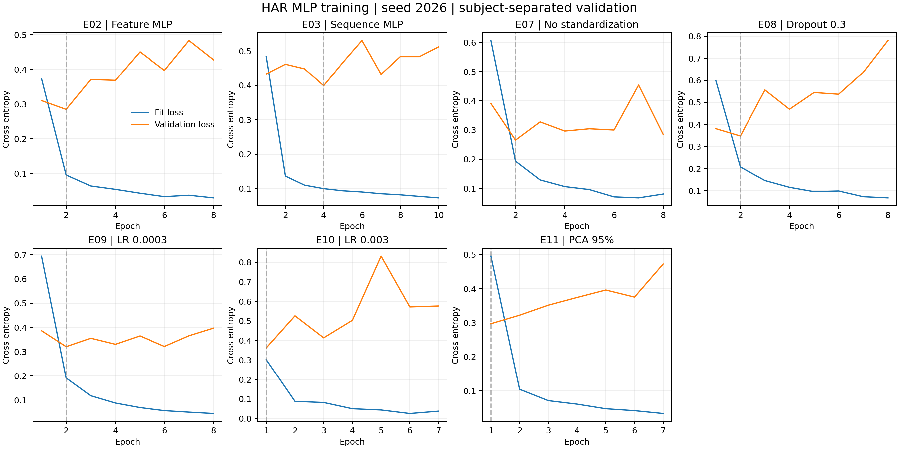

# 이봉헌 담당 MLP 학습 실험 결과

UCI HAR 공식 데이터로 담당 실험 7개를 실제 실행한 기록이다. 모든 점수는 검증 5명 1,775개에 대한 seed 2026 결과이며 공식 시험 성능이 아니다.

학습 16명 5,577개, 검증 사람 1·6·14·21·23. 모든 전처리는 학습 부분에서만 추정했다. 최대 40 epoch, 배치 64, Adam, val_loss patience 6, 최저 검증 손실 가중치 복원을 공통 적용했다.

| 실험 | Accuracy | Macro F1 | 파라미터 | 최선 epoch / 실행 epoch | 학습 초 |
|---|---:|---:|---:|---:|---:|
| E02 Feature MLP | 0.9161 | 0.9138 | 80,582 | 2 / 8 | 4.77 |
| E03 Sequence MLP | 0.8783 | 0.8765 | 156,230 | 4 / 10 | 5.75 |
| E07 No standardization | 0.8873 | 0.8864 | 80,582 | 2 / 8 | 4.75 |
| E08 Dropout 0.3 | 0.8952 | 0.8940 | 80,582 | 2 / 8 | 5.87 |
| E09 LR 0.0003 | 0.8772 | 0.8749 | 80,582 | 2 / 8 | 4.48 |
| E10 LR 0.003 | 0.8913 | 0.8899 | 80,582 | 1 / 7 | 4.53 |
| E11 PCA 95% | 0.8811 | 0.8795 | 21,574 | 1 / 7 | 4.52 |

## 비교 해석

이 7개 중 검증 macro F1가 가장 높은 설정은 E02 (0.9138)이다. 전체 팀의 E01–E13 비교가 끝나기 전에는 최종 모델로 확정하지 않는다.

- E03 (Sequence MLP): E02 대비 macro F1 -3.73 percentage points.
- E07 (No standardization): E02 대비 macro F1 -2.74 percentage points.
- E08 (Dropout 0.3): E02 대비 macro F1 -1.99 percentage points.
- E09 (LR 0.0003): E02 대비 macro F1 -3.90 percentage points.
- E10 (LR 0.003): E02 대비 macro F1 -2.40 percentage points.
- E11 (PCA 95%): E02 대비 macro F1 -3.43 percentage points.

E03은 입력 표현과 파라미터 수가 함께 바뀌므로 차이를 구조만의 효과로 해석할 수 없다. E11도 PCA 차원과 첫 층 파라미터 수가 함께 바뀐다. E07은 원 561 특징 자체가 이미 대체로 -1~1로 가공된 조건의 비교다.

Dropout 및 학습률 실험은 한 번에 한 조건만 바꾸었다. 단일 seed의 차이는 우연 변동을 포함할 수 있으므로 통계적으로 우수하다고 주장하지 않는다. 조건별 최고값을 임의로 합친 모델도 만들지 않았다.

학습 시간은 동일 CPU에서 model.fit 시작부터 종료까지이며 그래프 준비·데이터 캐시·검증·F1 콜백을 포함한다. 데이터 다운로드·로딩·전처리·모델 저장은 제외한다. 다른 장치나 모델의 추론 시간과 직접 비교할 값은 아니다.

## 재현 파일

각 runs/formal/E##_seed2026 폴더에 model.keras, preprocess.npz, metadata.json, config.json, split.json, history.csv, validation_predictions.csv, metrics.json, reload_check.json, status.json을 저장했다.

metadata의 모델은 최저 검증 손실의 가중치를 가진다. 저장된 optimizer 상태는 마지막 학습 시점의 상태여서 정확한 학습 재개용 체크포인트로 사용하지 않는다. 추론·평가에는 compile=False로 불러온다.

## 팀 인계와 남은 공동 확인

① 데이터 담당자가 제공하는 모듈과 sample_id·분할·전처리 수치가 일치하는지 확인한다. ④ 담당자는 전체 모델의 seed 2027·2028 반복과 9주차 공식 시험 평가를 진행한다. ⑤ 담당자는 시연·입력 오류 처리·실행 시간 측정에 이 저장물을 연결한다. 팀원의 실제 환경 실행 확인은 아직 별도 확인이 필요하다.

출처: [UCI HAR](https://archive.ics.uci.edu/dataset/240/human+activity+recognition+using+smartphones), DOI 10.24432/C54S4K, CC BY 4.0.
